# DJcode — Project Documentation

> Local-first AI coding CLI by DarshJ.AI

- **Version:** 1.3.0 (v2.0 features merged)
- **Repo:** [github.com/darshjme/djcode](https://github.com/darshjme/djcode)
- **Website:** [cli.darshj.ai](https://cli.darshj.ai)
- **License:** MIT
- **Author:** DarshJ (darsh@darshj.ai)
- **Python:** >=3.12
- **Install:**
  ```bash
  curl -fsSL https://cli.darshj.ai/install.sh | bash
  ```

---

## 1. Project Overview

DJcode is a local-first AI coding CLI that runs entirely on your machine. No cloud. No subscription. Your code stays yours. It connects to local LLM backends (Ollama, MLX) or cloud providers (OpenAI, Anthropic, Google, Groq, NVIDIA NIM, Together AI, OpenRouter) through a unified interface. It features 22 specialist AI agents (10 dev + 12 content), a multi-agent orchestrator with semantic routing, a smart prompt enhancer, a dharmic ASCII buddy companion, 3-tier memory with ChromaDB vector store, a full TUI with keyboard shortcuts, teachable skills, voice input, and a complete content creation pipeline.

---

## 2. Full Development Timeline

### Phase 1: Core CLI (v1.0 - v1.2)

| Date | Hash | Commit | Key Changes |
|------|------|--------|-------------|
| 2026-03-20 | `94a1fce` | feat: DJcode Python CLI -- local-first AI coding agent | Initial codebase: CLI, REPL, provider abstraction, 8 tools, memory system, operator agent, config, tests. **29 files, +2,457 lines** |
| 2026-04-06 | `78622cb` | fix: gemma4 default, tool fallback for incompatible models | Default model set to gemma4, tool fallback for models without function calling. **+28/-18 lines** |
| 2026-04-07 | `b3dd3c9` | docs: world-class README with mermaid architecture | README rewrite with architecture diagrams, model tables, feature showcase. **+226/-58 lines** |
| 2026-04-07 | `c85256e` | feat: buddy system (6 dharmic species), update checker, DAF | Buddy companion, update checker, onboarding wizard, provider expansion. **11 files, +1,308/-74 lines** |
| 2026-04-07 | `83459a1` | fix: default model gemma4, e2e verified | Integration fix: buddy + updater + onboarding wired together. |
| 2026-04-07 | `ecf61f7` | feat: v1.0.0 -- ASCII splash, onboarding, ChromaDB, status bar | ChromaDB added, uv.lock generated. **+1,557 lines** |
| 2026-04-07 | `bf4208d` | feat: v1.1.0 -- bottom bar, interactive pickers, uncensored, 9 auth | Auth system (9 providers), interactive model/provider pickers, uncensored mode, status bar polish. **11 files, +771/-201 lines** |
| 2026-04-07 | `0b43c35` | fix: wire update checker to startup | Update checker connected to REPL startup. **+9 lines** |
| 2026-04-07 | `83034bc` | feat: v1.2.0 -- all audit gaps fixed, production-grade | System prompt, web_fetch tool, provider hardening, tool confirmation gate. **8 files, +297/-4 lines** |

### Phase 2: Smart Buddy + Prompt Enhancer (v1.3)

| Date | Hash | Commit | Key Changes |
|------|------|--------|-------------|
| 2026-04-07 | `721c3fd` | fix: /model interactive picker crash | Questionary run in thread executor to avoid asyncio conflict. **+13/-7 lines** |
| 2026-04-07 | `3c9b7a7` | feat: Fenwick-style smart ASCII buddy with speech bubbles | Complete buddy rewrite: context-aware reactions, mood system, 6 dharmic species, speech bubbles. **+930/-271 lines** |
| 2026-04-07 | `542791d` | feat: smart prompt enhancement -- auto-enriches every prompt | Prompt enhancer with intent classification, context injection, multi-strategy enrichment. **+316/-2 lines** |
| 2026-04-07 | `ef94e77` | feat: v1.3.0 -- repo rename, PhD-grade README, installer | Version bump, install.sh, README overhaul. **+574/-158 lines** |

### Phase 3: Orchestrator + Agents (v1.3+)

| Date | Hash | Commit | Key Changes |
|------|------|--------|-------------|
| 2026-04-07 | `a555792` | fix: asyncio.run() crash in tool confirmation gate | Fixed nested asyncio.run() in tool gate. **+10/-1 lines** |
| 2026-04-07 | `817aff0` | fix: buddy now shows subtle one-line quips | Buddy output reduced to one-line quips instead of full ASCII blocks. **+10/-6 lines** |
| 2026-04-07 | `1918eb7` | feat: add competitor comparison chart to README | Comparison table: DJcode vs Claude Code vs Gemini CLI vs Aider. **+19 lines** |
| 2026-04-07 | `3f43873` | feat: TUI polish -- compact tool display, spinner prep | Operator tool display compacted, spinner preparation. **+54/-21 lines** |
| 2026-04-07 | `e67c878` | feat: 10 PhD-level agent registry -- DAF framework core | 10 specialist agents with dharmic names, tool policies, system prompts. **+405 lines** |
| 2026-04-08 | `b2a4850` | feat: verbose thinking output + buddy silenced per-response | Thinking mode toggle, operator verbose output. **+182/-15 lines** |
| 2026-04-08 | `1a4eed3` | feat: /stats dashboard, multi-step reasoning, verbose thinking | Stats module with session tracking, activity heatmaps, usage analytics. **+454/-1 lines** |
| 2026-04-08 | `502ae36` | feat: smart error detection with actionable messages | Error classification, actionable fix suggestions, fallback logic. **+246/-5 lines** |
| 2026-04-08 | `5eb09ac` | feat: multi-agent orchestrator with 10 specialist agents | Orchestrator engine, context bus, agent runner, REPL integration. **4 files, +608/-1 lines** |
| 2026-04-08 | `c64c125` | feat: semantic router + vector context store | Semantic intent router, vector context store for model-agnostic agent dispatch. **+485/-6 lines** |
| 2026-04-08 | `1c1c8a1` | feat: content agents + /launch pipeline + DarshjDB default | 12 content agents, /launch full pipeline, /campaign, /image, /video, /social. **+525/-1 lines** |
| 2026-04-08 | `1b7b5cf` | fix: remove chai species from buddy -- dharmic species only | Removed non-dharmic species. **-46 lines** |

### Phase 4: TUI Overhaul + Voice + Skills (v2.0)

| Date | Hash | Commit | Key Changes |
|------|------|--------|-------------|
| 2026-04-08 | `c9e2753` | feat: djcode.md context persistence + permission system | Per-project djcode.md context file, permission manager for tool calls. **+446/-1 lines** |
| 2026-04-08 | `49c535d` | feat: v2.0 -- TUI overhaul, 3D ASCII, voice, skills, installer | TUI keybindings, mode system, command picker, voice input, teachable skills, installer wizard, buddy 3D ASCII art, status bar redesign. **7 files, +2,444/-11 lines** |
| 2026-04-08 | `ebd67fb` | feat: rich emoji-structured output style in system prompt | System prompt restructured with emoji-structured output formatting. **+33/-7 lines** |

---

## 3. Architecture

```mermaid
graph TB
    subgraph "Entry"
        CLI["cli.py<br/>Click CLI"]
        MAIN["__main__.py"]
    end

    subgraph "REPL Loop"
        REPL["repl.py<br/>Interactive REPL"]
        TUI["tui.py<br/>Keybindings + Modes"]
        STATUS["status.py<br/>Bottom Toolbar"]
        BUDDY["buddy.py<br/>ASCII Companion"]
    end

    subgraph "Intelligence"
        OPERATOR["operator.py<br/>Main Agent"]
        ENHANCER["prompt_enhancer.py<br/>Intent + Context"]
        PROMPT["prompt.py<br/>System Prompt Builder"]
        ERRORS["errors.py<br/>Smart Error Detection"]
    end

    subgraph "Orchestrator"
        ENGINE["engine.py<br/>Agent Runner"]
        ROUTER["router.py<br/>Semantic Router"]
        CBUS["context_bus.py<br/>Shared State"]
        VCTX["vector_context.py<br/>Vector Store"]
    end

    subgraph "Agent Registries"
        DEV_REG["registry.py<br/>10 Dev Agents"]
        CONTENT_REG["content_registry.py<br/>12 Content Agents"]
    end

    subgraph "Provider Layer"
        PROVIDER["provider.py<br/>LLM Abstraction"]
        AUTH["auth.py<br/>9 Providers"]
    end

    subgraph "Tools (8)"
        T_BASH["bash"]
        T_READ["file_read"]
        T_WRITE["file_write"]
        T_EDIT["file_edit"]
        T_GREP["grep"]
        T_GLOB["glob"]
        T_GIT["git"]
        T_WEB["web_fetch"]
    end

    subgraph "Memory (3 Tiers)"
        MEMORY["manager.py<br/>Memory Manager"]
        EMBEDDER["embedder.py<br/>ChromaDB Vectors"]
    end

    subgraph "Extensions"
        SKILLS["skills.py<br/>Teachable Skills"]
        VOICE["voice.py<br/>Voice Input"]
        INSTALLER["installer.py<br/>Setup Wizard"]
        CONTEXT["context_file.py<br/>djcode.md"]
        PERMS["permissions.py<br/>Tool Permissions"]
        ONBOARD["onboarding.py<br/>First-Run"]
        UPDATER["updater.py<br/>Auto-Update"]
        STATS["stats.py<br/>Usage Analytics"]
        CONFIG["config.py<br/>Settings"]
    end

    MAIN --> CLI
    CLI --> REPL
    REPL --> TUI
    REPL --> STATUS
    REPL --> BUDDY
    REPL --> OPERATOR
    REPL --> ENHANCER
    OPERATOR --> PROMPT
    OPERATOR --> PROVIDER
    OPERATOR --> ERRORS
    PROVIDER --> AUTH
    REPL --> ENGINE
    ENGINE --> ROUTER
    ENGINE --> CBUS
    ROUTER --> VCTX
    ENGINE --> DEV_REG
    ENGINE --> CONTENT_REG
    OPERATOR --> T_BASH
    OPERATOR --> T_READ
    OPERATOR --> T_WRITE
    OPERATOR --> T_EDIT
    OPERATOR --> T_GREP
    OPERATOR --> T_GLOB
    OPERATOR --> T_GIT
    OPERATOR --> T_WEB
    REPL --> MEMORY
    MEMORY --> EMBEDDER
    REPL --> SKILLS
    REPL --> VOICE
    REPL --> CONTEXT
    REPL --> PERMS
    CLI --> ONBOARD
    CLI --> UPDATER
    REPL --> STATS
    CLI --> CONFIG
```



---

## 4. Module Inventory

| # | Path | Lines | Purpose | Key Classes/Functions |
|---|------|------:|---------|----------------------|
| 1 | `src/djcode/__init__.py` | 4 | Package root, version | `__version__`, `__author__` |
| 2 | `src/djcode/__main__.py` | 6 | Entry point | `python -m djcode` |
| 3 | `src/djcode/cli.py` | 135 | Click CLI interface | `main()`, `--provider`, `--model`, `--raw`, `--auto-accept` |
| 4 | `src/djcode/repl.py` | 1,070 | Interactive REPL loop | `run_repl()`, `handle_slash_command()`, `print_banner()` |
| 5 | `src/djcode/tui.py` | 456 | TUI keybindings + modes | `ModeState`, `register_keybindings()`, `show_command_picker()`, `ProgressTracker` |
| 6 | `src/djcode/status.py` | 150 | Bottom toolbar | `StatusBar` |
| 7 | `src/djcode/buddy.py` | 1,541 | ASCII buddy companion | `Buddy`, `BuddyContext`, speech bubbles, mood system, 6 dharmic species |
| 8 | `src/djcode/provider.py` | 693 | LLM provider abstraction | `Provider`, `ProviderConfig`, `Message`, streaming, fuzzy model match |
| 9 | `src/djcode/auth.py` | 239 | Auth + provider registry | `PROVIDERS` (9 entries), `get_api_key()`, `is_uncensored_model()` |
| 10 | `src/djcode/config.py` | 73 | Config management | `load_config()`, `set_value()`, `ensure_dirs()` |
| 11 | `src/djcode/prompt.py` | 201 | System prompt builder | `build_system_prompt()`, `detect_refusal()`, model-aware prompts |
| 12 | `src/djcode/prompt_enhancer.py` | 303 | Prompt enrichment | `enhance_prompt()`, `EnhancedPrompt`, intent classification, context injection |
| 13 | `src/djcode/errors.py` | 236 | Smart error detection | `classify_error()`, actionable messages, fallback suggestions |
| 14 | `src/djcode/agents/__init__.py` | 1 | Agents package | |
| 15 | `src/djcode/agents/operator.py` | 438 | Main operator agent | `Operator`, tool execution, streaming, thinking output |
| 16 | `src/djcode/agents/architect.py` | 57 | Architect helper | Architecture plan generation |
| 17 | `src/djcode/agents/scout.py` | 46 | Scout helper | Read-only codebase exploration |
| 18 | `src/djcode/agents/registry.py` | 405 | 10 dev agent specs | `AgentRole`, `AgentSpec`, `AGENT_SPECS`, `get_agent_for_intent()` |
| 19 | `src/djcode/agents/content_registry.py` | 421 | 12 content agent specs | `ContentRole`, `CONTENT_SPECS`, `get_content_agent_for_intent()` |
| 20 | `src/djcode/orchestrator/__init__.py` | 12 | Orchestrator package | `Orchestrator` export |
| 21 | `src/djcode/orchestrator/engine.py` | 464 | Agent runner + dispatch | `Orchestrator`, `AgentRunner`, `run_streaming()` |
| 22 | `src/djcode/orchestrator/router.py` | 231 | Semantic intent routing | `SemanticRouter`, intent-to-agent mapping |
| 23 | `src/djcode/orchestrator/context_bus.py` | 112 | Shared agent state | `ContextBus`, cross-agent knowledge sharing |
| 24 | `src/djcode/orchestrator/vector_context.py` | 199 | Vector context store | ChromaDB-backed context for agent dispatch |
| 25 | `src/djcode/memory/__init__.py` | 1 | Memory package | |
| 26 | `src/djcode/memory/manager.py` | 213 | Memory manager | `MemoryManager`, session messages, persistent facts, recall |
| 27 | `src/djcode/memory/embedder.py` | 144 | ChromaDB embeddings | Embedding store, semantic search |
| 28 | `src/djcode/tools/__init__.py` | 38 | Tool registry | `TOOL_DEFINITIONS`, `TOOL_HANDLERS` |
| 29 | `src/djcode/tools/bash.py` | 41 | Bash execution | `tool_bash()` |
| 30 | `src/djcode/tools/file_read.py` | 35 | File read | `tool_file_read()` |
| 31 | `src/djcode/tools/file_write.py` | 17 | File write | `tool_file_write()` |
| 32 | `src/djcode/tools/file_edit.py` | 32 | File edit (surgical) | `tool_file_edit()` |
| 33 | `src/djcode/tools/grep.py` | 55 | Regex search | `tool_grep()` |
| 34 | `src/djcode/tools/glob.py` | 34 | Pattern file find | `tool_glob()` |
| 35 | `src/djcode/tools/git.py` | 65 | Git operations | `tool_git()` |
| 36 | `src/djcode/tools/web_fetch.py` | 31 | URL fetch | `tool_web_fetch()` |
| 37 | `src/djcode/skills.py` | 433 | Teachable skills | `Skill`, `SkillStore`, `.skill.md` format |
| 38 | `src/djcode/voice.py` | 429 | Voice input | Voice-to-text via sounddevice |
| 39 | `src/djcode/installer.py` | 477 | Setup wizard | Interactive installation, dependency checks |
| 40 | `src/djcode/context_file.py` | 180 | Per-project context | `djcode.md` persistence, auto-load |
| 41 | `src/djcode/permissions.py` | 192 | Tool permissions | `PermissionManager`, allow/deny/ask rules |
| 42 | `src/djcode/onboarding.py` | 222 | First-run wizard | `needs_onboarding()`, `run_onboarding()` |
| 43 | `src/djcode/updater.py` | 139 | Auto-update checker | `get_update_message()`, version comparison |
| 44 | `src/djcode/stats.py` | 421 | Usage analytics | `record_session_start()`, `render_stats()`, activity heatmaps |
| 45 | `tests/test_cli.py` | 252 | CLI test suite | pytest tests for CLI, config, tools |
| 46 | `tests/__init__.py` | 0 | Test package | |

---

## 5. Feature Matrix

| Feature | Status | Module |
|---------|--------|--------|
| Interactive REPL with streaming | Done | `repl.py` |
| 9 LLM providers (local + cloud) | Done | `auth.py`, `provider.py` |
| Fuzzy model matching | Done | `provider.py` |
| 8 async tool handlers | Done | `tools/` |
| Tool confirmation gate | Done | `operator.py`, `permissions.py` |
| Auto-accept mode | Done | `tui.py`, `repl.py` |
| Smart prompt enhancement | Done | `prompt_enhancer.py` |
| Intent classification | Done | `prompt_enhancer.py`, `router.py` |
| Multi-agent orchestrator | Done | `orchestrator/` |
| 10 PhD-level dev agents | Done | `agents/registry.py` |
| 12 content specialist agents | Done | `agents/content_registry.py` |
| Semantic routing (intent -> agent) | Done | `orchestrator/router.py` |
| Context bus (cross-agent state) | Done | `orchestrator/context_bus.py` |
| Vector context store (ChromaDB) | Done | `orchestrator/vector_context.py` |
| 3-tier memory system | Done | `memory/` |
| ChromaDB embeddings | Done | `memory/embedder.py` |
| Persistent facts (/remember, /recall) | Done | `memory/manager.py` |
| Smart ASCII buddy (6 dharmic species) | Done | `buddy.py` |
| Mood system + context-aware reactions | Done | `buddy.py` |
| Speech bubbles | Done | `buddy.py` |
| Keyboard shortcuts (7 bindings) | Done | `tui.py` |
| Plan/Act mode toggle | Done | `tui.py` |
| Interactive command picker (fuzzy /) | Done | `tui.py` |
| Verbose thinking toggle | Done | `operator.py`, `tui.py` |
| Bottom status toolbar | Done | `status.py` |
| Onboarding wizard | Done | `onboarding.py` |
| Auto-update checker | Done | `updater.py` |
| Usage stats + activity heatmap | Done | `stats.py` |
| Uncensored model detection | Done | `auth.py` |
| Censorship refusal detection | Done | `prompt.py` |
| Smart error detection + fallback | Done | `errors.py` |
| Teachable skills (.skill.md) | Done | `skills.py` |
| Voice input | Done | `voice.py` |
| Per-project djcode.md context | Done | `context_file.py` |
| Permission system | Done | `permissions.py` |
| Installer wizard | Done | `installer.py` |
| /launch full pipeline (build+campaign) | Done | `repl.py` |
| Rich emoji-structured output | Done | `prompt.py` |
| Raw mode toggle | Done | `repl.py` |
| Conversation save | Done | `repl.py` |
| ASCII splash screen | Done | `repl.py` |

---

## 6. Agent Registry (22 Total)

### Dev Agents (10)

| # | Name | Role | Title | Temp | Tools | Read-Only | Priority |
|---|------|------|-------|------|-------|-----------|----------|
| 1 | Vyasa | orchestrator | PhD Orchestrator | 0.3 | all 8 | No | 1 |
| 2 | Prometheus | coder | Senior Full-Stack Engineer | 0.4 | all 8 | No | 2 |
| 3 | Sherlock | debugger | Root Cause Analyst | 0.2 | all 8 | No | 2 |
| 4 | Vishwakarma | architect | Systems Architect | 0.5 | read (5) | Yes | 3 |
| 5 | Dharma | reviewer | Code Reviewer | 0.3 | read (5) | Yes | 3 |
| 6 | Agni | tester | QA Engineer | 0.3 | all 8 | No | 4 |
| 7 | Garuda | scout | Recon Agent | 0.3 | read (5) | Yes | 5 |
| 8 | Vayu | devops | DevOps Engineer | 0.3 | all 8 | No | 4 |
| 9 | Saraswati | docs | Technical Writer | 0.6 | all 8 | No | 6 |
| 10 | Shiva | refactorer | Refactoring Specialist | 0.3 | all 8 | No | 4 |

### Content Agents (12)

| # | Name | Role | Title | Temp | Tools | Read-Only | Priority |
|---|------|------|-------|------|-------|-----------|----------|
| 1 | Narada | campaign_director | Campaign Director | 0.3 | all 7 | No | 1 |
| 2 | Valmiki | script_writer | Script Writer | 0.7 | all 7 | No | 2 |
| 3 | Chitragupta | social_strategist | Social Media Strategist | 0.6 | all 7 | No | 2 |
| 4 | Maya | image_prompter | Image Prompter | 0.8 | read+write | No | 3 |
| 5 | Kubera | video_director | Video Director | 0.7 | all 7 | No | 3 |
| 6 | Tvastar | comfyui_expert | ComfyUI Expert | 0.4 | all 7 | No | 4 |
| 7 | Gandharva | audio_prompter | Audio/Music Prompter | 0.7 | read+write | No | 4 |
| 8 | Brihaspati | seo_analyst | SEO Analyst | 0.3 | read (4) | Yes | 4 |
| 9 | Saraswati | brand_voice | Brand Voice Writer | 0.5 | all 7 | No | 3 |
| 10 | Vishvakarma | thumbnail_designer | Thumbnail Designer | 0.6 | read+write | No | 5 |
| 11 | Hanuman | content_repurposer | Content Repurposer | 0.6 | all 7 | No | 4 |
| 12 | Garuda | trend_scout | Trend Scout | 0.3 | read (4) | Yes | 5 |

---

## 7. Slash Commands (38)

| # | Command | Agent/Module | Description |
|---|---------|-------------|-------------|
| 1 | `/help` | repl | Show help |
| 2 | `/model` | repl | Interactive model picker (arrow keys) |
| 3 | `/model <name>` | repl | Switch model (fuzzy match) |
| 4 | `/models` | repl | List available models |
| 5 | `/provider` | repl | Interactive provider picker |
| 6 | `/auth` | auth | Configure provider + API key |
| 7 | `/auto` | repl | Toggle auto-accept tool calls |
| 8 | `/scout <query>` | Garuda | Read-only codebase exploration |
| 9 | `/architect <task>` | Vishwakarma | Generate implementation plan |
| 10 | `/uncensored` | repl | Show uncensored model info |
| 11 | `/memory` | memory | Show memory stats |
| 12 | `/remember k=v` | memory | Store a persistent fact |
| 13 | `/recall <key>` | memory | Recall a persistent fact |
| 14 | `/forget <key>` | memory | Remove a persistent fact |
| 15 | `/clear` | repl | Clear conversation history |
| 16 | `/save` | repl | Save conversation to disk |
| 17 | `/config` | config | Show current config |
| 18 | `/set k=v` | config | Set a config value |
| 19 | `/orchestra <task>` | Vyasa | Multi-agent orchestration (auto-dispatch) |
| 20 | `/review <code>` | Dharma | Code review |
| 21 | `/debug <issue>` | Sherlock | Root cause analysis |
| 22 | `/test <target>` | Agni | Write tests |
| 23 | `/refactor <code>` | Shiva | Restructure code |
| 24 | `/devops <task>` | Vayu | Docker/CI/CD |
| 25 | `/docs <target>` | Saraswati | Generate documentation |
| 26 | `/launch <product>` | Pipeline | Build + Ship + Campaign (full pipeline) |
| 27 | `/campaign <brief>` | Narada | Content campaign (12 content agents) |
| 28 | `/image <concept>` | Maya | Generate image prompts |
| 29 | `/video <concept>` | Kubera | Cinematic video prompts |
| 30 | `/social <topic>` | Chitragupta | Social media content |
| 31 | `/agents` | repl | Show all 22 agents roster |
| 32 | `/stats` | stats | Usage dashboard with activity heatmap |
| 33 | `/stats 7d` | stats | Last 7 days stats |
| 34 | `/stats 30d` | stats | Last 30 days stats |
| 35 | `/buddy` | buddy | Show your buddy + speech bubble |
| 36 | `/buddy pet` | buddy | Pet your buddy |
| 37 | `/buddy species` | buddy | Show all species |
| 38 | `/raw` | repl | Toggle raw mode (no formatting) |
| 39 | `/shortcuts` | tui | Show keyboard shortcuts |
| 40 | `/exit` | repl | Exit DJcode |
| 41 | `/quit` | repl | Exit DJcode (alias) |
| 42 | `/q` | repl | Exit DJcode (alias) |
| 43 | `/` (bare) | tui | Interactive fuzzy command picker |

---

## 8. Keyboard Shortcuts

| Key | Action |
|-----|--------|
| `Ctrl+O` | Toggle verbose/thinking mode |
| `Ctrl+L` | Clear screen (keep conversation) |
| `Ctrl+R` | Rerun last command |
| `Ctrl+T` | Toggle auto-accept tools |
| `Ctrl+K` | Kill current generation |
| `Ctrl+P` | Toggle plan/act mode |
| `Escape` | Cancel current input |

---

## 9. Comparison Chart

| Feature | DJcode | Claude Code | Gemini CLI | Aider | OpenCode |
|---------|--------|-------------|------------|-------|----------|
| Local-first (Ollama/MLX) | Yes | No | No | Partial | Partial |
| Cloud providers | 9 | 1 (Anthropic) | 1 (Google) | 8+ | 3 |
| Specialist agents | 22 | 0 | 0 | 0 | 0 |
| Multi-agent orchestrator | Yes | No | No | No | No |
| Content creation pipeline | Yes | No | No | No | No |
| ASCII buddy companion | Yes | No | No | No | No |
| Prompt enhancement | Auto | No | No | No | No |
| Uncensored model support | Yes | No | No | Yes | No |
| Voice input | Yes | No | No | No | No |
| Teachable skills | Yes | No | No | No | No |
| Semantic routing | Yes | N/A | N/A | N/A | N/A |
| Vector memory (ChromaDB) | Yes | No | No | Yes | No |
| Permission system | Yes | Yes | No | No | No |
| Plan/Act mode | Yes | Yes | No | No | No |
| Free & open source | Yes | No | Yes | Yes | Yes |
| Apple Silicon optimized | Yes | No | No | No | No |
| Python, no Rust/Go deps | Yes | No | No | Yes | No |

---

## 10. Ecosystem

| Project | Type | Description |
|---------|------|-------------|
| **djcode** | CLI tool | This repo. Local-first AI coding CLI with 22 agents. |
| **djcode-site** | Next.js website | Marketing site at cli.darshj.ai. Install page, docs, comparison. |
| **agent-garden** | Dev framework | Framework/pattern for the 10 dev specialist agents. |
| **content-agent-garden** | Content framework | Framework/pattern for the 12 content specialist agents. |

---

## 11. Roadmap

- Version bump to v2.0 in `pyproject.toml` and `__init__.py`
- PyPI publish (`pip install djcode`)
- npm-style global install via `npx djcode`
- NVIDIA NIM demos integration
- CI pipeline (GitHub Actions) -- lint, test, build
- MCP (Model Context Protocol) tool server support
- Agent-to-agent delegation (agent spawns sub-agent)
- Persistent conversation threads
- Plugin system (community agents)
- Diff display with syntax highlighting
- Git commit agent (auto-commit with smart messages)
- Project scaffolding templates
- Multi-file refactoring with dependency graph
- Token budget management per agent
- Streaming progress indicators per tool

---

## 12. Stats

| Metric | Count |
|--------|------:|
| Total Python files | 46 |
| Total lines of code | 10,944 |
| Total dev agents | 10 |
| Total content agents | 12 |
| Total agents | 22 |
| Total slash commands | 43 (38 unique + 5 aliases/variants) |
| Total keyboard shortcuts | 7 |
| Total providers | 9 |
| Total tools | 8 |
| Total commits | 28 |
| Total test files | 1 (252 lines) |
| Dependencies | 6 core + 1 optional (voice) |
| First commit | 2026-03-20 |
| Latest commit | 2026-04-08 |

---

*Generated 2026-04-07. Source of truth: git log + source code.*
