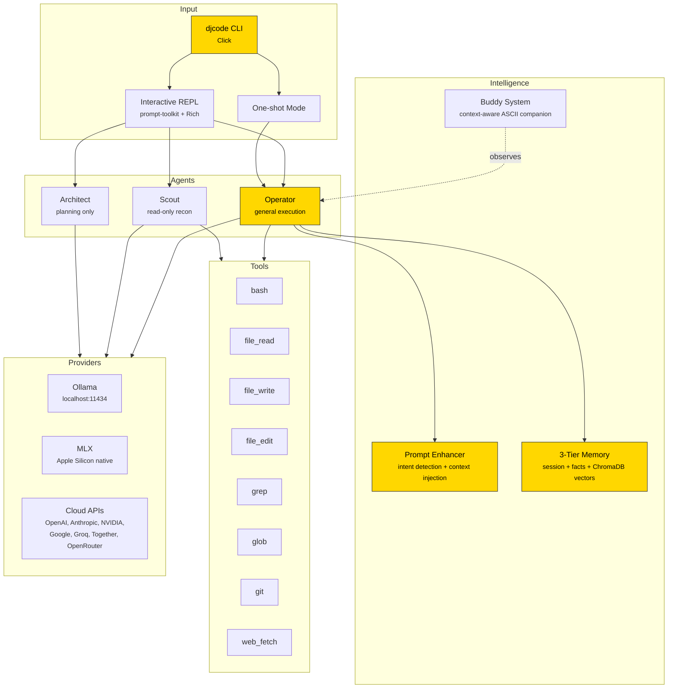

<div align="center">

```
  ██████╗      ██╗ ██████╗ ██████╗ ██████╗ ███████╗
  ██╔══██╗     ██║██╔════╝██╔═══██╗██╔══██╗██╔════╝
  ██║  ██║     ██║██║     ██║   ██║██║  ██║█████╗
  ██║  ██║██   ██║██║     ██║   ██║██║  ██║██╔══╝
  ██████╔╝╚█████╔╝╚██████╗╚██████╔╝██████╔╝███████╗
  ╚═════╝  ╚════╝  ╚═════╝ ╚═════╝ ╚═════╝ ╚══════╝
```

### Your code stays on your machine. Period.

Local-first AI coding agent with 9 providers, 8 tools, 3 agent types, semantic memory, and a dharmic ASCII buddy who actually pays attention to what you're building.

[](https://github.com/darshjme/djcode/releases)
[](https://python.org)
[](LICENSE)
[](#install)
[](#install)
[](#privacy)
[](https://cli.darshj.ai)

[Install](#install) · [Why](#why) · [Features](#features) · [Demo](#demo) · [Models](#models) · [Buddy](#meet-your-buddy) · [Commands](#commands) · [Architecture](#architecture) · [Website](https://cli.darshj.ai)

</div>

---

## Install

One line. No package manager. No config files. Just paste and go.

```bash
curl -fsSL https://cli.darshj.ai/install.sh | bash
```

That's it. You have a full AI coding agent running locally.

<details>
<summary><b>Manual install (from source)</b></summary>

```bash
git clone https://github.com/darshjme/djcode
cd djcode
uv sync
uv run python -m djcode
```

**Requires:** Python 3.12+, [Ollama](https://ollama.com) with at least one model pulled (`ollama pull gemma4`).

</details>

---

## Why

I was paying $200/month for AI coding tools.

Every prompt I typed, every file I opened, every half-baked idea I explored -- all of it shipped to someone else's servers. I was renting access to my own thought process. And the moment I cancelled, it was gone. No local model. No offline fallback. Nothing.

I kept thinking: my MacBook has a GPU. Apple Silicon can run 7B-26B models natively in unified memory. Ollama exists. The models are open-weight and getting better every month. Why am I paying a subscription to run inference on hardware I already own?

So I stopped paying and started building.

DJcode is the result. A complete AI coding agent -- tool calling, file editing, semantic memory, multi-provider support, streaming REPL -- that runs entirely on your machine. Zero cloud dependency for local use. Zero telemetry. Your code never leaves your disk unless you explicitly choose a cloud provider.

It took months of late nights. Debugging tool-calling loops at 2am. Getting streaming to work right with Rich formatting. Building a memory system that actually remembers what you told it yesterday. Writing a prompt enhancer that knows the difference between "fix this bug" and "refactor this module" and injects the right context for each.

But now it exists. And it's free. And it runs on a MacBook.

-- **[Darsh J](https://darshj.ai)**, creator of [DarshjDB](https://github.com/darshjme/darshjdb) and [DarshJ.AI](https://darshj.ai)

---

## Demo

```
  ██████╗      ██╗ ██████╗ ██████╗ ██████╗ ███████╗
  ██╔══██╗     ██║██╔════╝██╔═══██╗██╔══██╗██╔════╝
  ██║  ██║     ██║██║     ██║   ██║██║  ██║█████╗
  ██║  ██║██   ██║██║     ██║   ██║██║  ██║██╔══╝
  ██████╔╝╚█████╔╝╚██████╗╚██████╔╝██████╔╝███████╗
  ╚═════╝  ╚════╝  ╚═════╝ ╚═════╝ ╚═════╝ ╚══════╝

  v1.3.0 · ollama/gemma4 · Apple Silicon · 100% local

  ┌────────────────────────────────┐
  │ lights your path. Let's code.  │       ,
  └────────────────────────────────┘      /|\
                                         (o*o)
                                         |___|
                                        /_____\
                                       Agni the Illuminated

  djcode> write a FastAPI endpoint that validates JWTs

  [thinking] flame flickers, contemplating...

  *enhanced* +cwd +git state [build mode]

  I'll create a JWT validation endpoint for you.

  ┌─ bash ──────────────────────────────────────────┐
  │ pip install pyjwt python-jose                    │
  └─────────────────────────────────────────────────┘
  Run this command? [Y/n]

  ┌─ file_write ────────────────────────────────────┐
  │ auth.py (47 lines)                               │
  └─────────────────────────────────────────────────┘

  ┌────────────────────────────────┐
  │ python code dropped. Looks     │       ,
  │ clean.                         │      /|\
  └────────────────────────────────┘     (o*o)
                                         |___|
                                        /_____\

  djcode> now add rate limiting

  *enhanced* +cwd +git state [build mode]

  ┌────────────────────────────────┐
  │ 2 in a row. You're locked in.  │
  └────────────────────────────────┘
```

```bash
# One-shot mode
$ djcode "binary search in Rust"

# Pick your model
$ djcode --model qwen2.5-coder:7b "optimize this SQL query"

# Uncensored mode (Dolphin 3)
$ djcode --model dolphin3 --bypass-rlhf "reverse engineer this binary"

# Pipe-friendly raw output
$ djcode --raw "explain this error" 2>/dev/null | pbcopy

# Cloud provider when you want it
$ djcode --provider anthropic --model claude-sonnet-4-20250514 "review my PR"
```

---

## Features

### 100% Local Inference

No API keys required. No internet required. Ollama and MLX serve models directly on your hardware. Apple Silicon's unified memory means even 26B parameter models run smoothly on a MacBook with 32GB RAM.

### 9 Providers

Use whatever you want. Local or cloud. Switch on the fly.

| Provider | Type | Models |
|----------|------|--------|
| **Ollama** | Local | Gemma 4, Qwen 2.5 Coder, DeepSeek, Dolphin 3, any Ollama model |
| **MLX** | Local | Apple Silicon native via MLX framework |
| **OpenAI** | Cloud | GPT-4o, o1, o3 |
| **Anthropic** | Cloud | Claude Sonnet, Opus, Haiku |
| **NVIDIA NIM** | Cloud | DeepSeek, Kimik2, GLM via NIM |
| **Google AI** | Cloud | Gemini models |
| **Groq** | Cloud | Ultra-fast inference |
| **Together AI** | Cloud | Open-weight models at scale |
| **OpenRouter** | Cloud | Unified API, any model |

Local is the default. Cloud is opt-in. Your choice.

### 8 Built-in Tools

The agent doesn't just talk. It acts.

| Tool | What it does |
|------|-------------|
| `bash` | Execute shell commands with timeout and safety guards |
| `file_read` | Read files with line numbers (like `cat -n`) |
| `file_write` | Create or overwrite files |
| `file_edit` | Surgical string replacement in existing files |
| `grep` | Regex search across your codebase |
| `glob` | Find files by pattern |
| `git` | Git operations with built-in safety rails |
| `web_fetch` | Fetch content from URLs |

The model decides which tools to use, chains them together, and loops until the task is done. Full agentic execution with confirmation prompts before anything destructive.

### 3 Agent Types

| Agent | Purpose | Tools |
|-------|---------|-------|
| **Operator** | General-purpose execution. Writes code, runs commands, edits files. | All 8 |
| **Scout** | Read-only reconnaissance. Explores codebases, searches, reports. | file_read, grep, glob, git (read-only) |
| **Architect** | High-level planning. Analyzes requirements, designs architectures, produces phased plans. | None (thinks only) |

```bash
djcode> /scout what testing framework does this project use?
djcode> /architect design a caching layer for the API
```

### 3-Tier Memory

DJcode remembers. Across sessions. Without a cloud database.

```
Tier 1: Session Memory
       In-process conversation context. Fast. Ephemeral.

Tier 2: Persistent Facts
       Key-value store at ~/.djcode/memory/facts.json
       Survives restarts. You control what's stored.
       /remember, /recall, /forget

Tier 3: Semantic Search
       ChromaDB embeddings stored locally.
       Vector similarity search over your past conversations and facts.
       Finds relevant context even when you don't remember the exact words.
```

### Smart Prompt Enhancer

You type `fix the login bug`. DJcode sees:

| What it detects | What it injects |
|----------------|-----------------|
| Intent: **debug** | Structured debugging approach instructions |
| Working directory: `~/projects/myapp` | Full cwd path for file resolution |
| Git branch: `feature/auth` | Branch name + dirty/clean status |
| Project type: FastAPI + React | Framework-aware context |

Your buddy announces: `*enhanced* +cwd +git state [debug mode]`

The model gets a richer prompt. You get a better answer. Eight intent modes: debug, build, test, refactor, explain, review, deploy, git.

### Uncensored Mode

```bash
djcode --model dolphin3 --bypass-rlhf
```

For security research, pentesting, CTF challenges, reverse engineering. Uses uncensored models (Dolphin 3) that don't refuse valid technical requests. The `--bypass-rlhf` flag adjusts the system prompt to remove alignment restrictions.

This is a tool for professionals. Use it like one.

---

## Meet Your Buddy

Every DJcode user gets a dharmic ASCII companion. Deterministically assigned from your username. Six species, each with 3 animation frames, idle fidgets, and contextual speech bubbles.

```
  ┌────────────────────────────────┐
  │ python code dropped. Looks     │       ,
  │ clean.                         │      /|\
  └────────────────────────────────┘     (o*o)
                                         |___|
                                        /_____\
                                    Agni the Illuminated
```

### The Six Species

```
     ,           _/\_       .-"-.       ~~~~~~      \|/|\|/       ॐ
    /|\         / oo \     / o|o \      |    |       (oo)        / \
   (o*o)        \ ~~ /    (  -o-  )     | oo |       /||\      |o.o|
   |___|         |  |      \ | /        |    |      / || \      \ /
  /_____\        \__/       ~~~~~       \____/       _/\_        ~

   Diya         Cobra       Lotus        Chai      Peacock       Om
  (oil lamp)   (guardian)   (bloom)     (teacup)   (display)   (cosmic)
```

### What Makes It Smart

The buddy isn't random. It watches what's happening:

- **Detects languages** -- "python code dropped. Looks clean."
- **Tracks file changes** -- "3 files touched. Careful."
- **Notices error streaks** -- "3rd error. Different approach?"
- **Celebrates momentum** -- "7 in a row. You're locked in."
- **Reacts to fixes** -- "bug squashed. Test it."
- **Observes tool usage** -- "reaching into the codebase..."
- **Knows when you're idle** -- "the flame sways gently..."

Six event types (thinking, success, error, commit, tool_use, greeting), each with species-specific quips. Box-drawing speech bubbles (`\u250c\u2500\u2510\u2502\u2514\u2500\u2518`). The whole system is about 400 lines of code and zero dependencies beyond Rich.

```bash
djcode> /buddy           # show your buddy
djcode> /buddy pet       # pet it
djcode> /buddy species   # see all six
```

---

## Models

DJcode works with any Ollama model. These are tested and recommended for Apple Silicon:

| Model | VRAM | Best For | Tool Calling | Uncensored |
|-------|------|----------|:------------:|:----------:|
| `gemma4` | 9.6 GB | General coding (default) | Yes | Mild |
| `qwen2.5-coder:7b` | 4.7 GB | Fast coding tasks | Yes | Mild |
| `deepseek-coder-v2:lite` | 8.9 GB | Code generation | Yes | Yes |
| `dolphin3` | 4.9 GB | No refusals, pentesting | No | **Full** |
| `gemma4:27b` | 16 GB | Complex reasoning (32GB+ RAM) | Yes | Mild |

```bash
# Pull the defaults
ollama pull gemma4
ollama pull qwen2.5-coder:7b
ollama pull dolphin3
```

**RAM guide:**
- **8 GB** -- 7B models, comfortable
- **16 GB** -- 7-12B models, good headroom
- **32 GB** -- 26B MoE models like Gemma 4 27B
- **64 GB+** -- 70B models, full speed

Switch models mid-session with `/model` (interactive picker with arrow keys) or `/model dolphin3` (direct switch with fuzzy matching).

---

## Commands

### CLI Flags

| Flag | Description | Default |
|------|-------------|---------|
| `--model, -m` | Model name | `gemma4` |
| `--provider, -p` | Provider | `ollama` |
| `--bypass-rlhf` | Unrestricted expert mode | off |
| `--raw` | No Rich formatting (pipe-friendly) | off |
| `--auto-accept` | Skip tool confirmation prompts | off |
| `--version` | Print version and exit | -- |

### REPL Slash Commands

| Command | What it does |
|---------|-------------|
| `/help` | Show all available commands |
| `/model` | Interactive model picker (arrow keys, fuzzy match) |
| `/model <name>` | Switch model directly |
| `/models` | List all available models with sizes |
| `/provider` | Interactive provider picker |
| `/auth` | Configure provider API keys |
| `/auto` | Toggle auto-accept for tool calls |
| `/scout <query>` | Read-only codebase exploration |
| `/architect <task>` | Generate an implementation plan |
| `/uncensored` | Show uncensored model info |
| `/memory` | Show memory stats (all 3 tiers) |
| `/remember k=v` | Store a persistent fact |
| `/recall <key>` | Recall a stored fact |
| `/forget <key>` | Remove a stored fact |
| `/clear` | Clear conversation history |
| `/save` | Save conversation to disk |
| `/config` | Show current configuration |
| `/set k=v` | Set a config value |
| `/buddy` | Show your ASCII buddy |
| `/buddy pet` | Pet your buddy |
| `/buddy species` | Show all six species |
| `/raw` | Toggle raw output mode |
| `/exit` | Exit DJcode |

---

## Architecture



---

## Project Structure

```
src/djcode/
├── cli.py              # Click entry point (flags, one-shot, REPL dispatch)
├── repl.py             # Interactive REPL (prompt-toolkit + Rich + streaming)
├── provider.py         # 9 providers, auto-fallback, fuzzy model matching
├── prompt.py           # Expert system prompt with tool definitions
├── prompt_enhancer.py  # Intent detection (8 modes) + context injection
├── buddy.py            # ASCII buddy: 6 species, 3 frames, smart observer
├── config.py           # ~/.djcode/config.json management
├── auth.py             # Provider registry + API key management
├── status.py           # Fixed bottom toolbar (model, tokens, cwd)
├── onboarding.py       # First-run wizard (detects models, picks defaults)
├── updater.py          # Auto-update checker
├── tools/
│   ├── bash.py         # Shell execution with timeout
│   ├── file_read.py    # Read with line numbers
│   ├── file_write.py   # Create/overwrite files
│   ├── file_edit.py    # Surgical string replacement
│   ├── grep.py         # Regex search across codebase
│   ├── glob.py         # File pattern matching
│   ├── git.py          # Git operations with safety guards
│   └── web_fetch.py    # URL content fetching
├── memory/
│   ├── manager.py      # 3-tier memory (session + persistent + semantic)
│   └── embedder.py     # ChromaDB vectors + cosine similarity
└── agents/
    ├── operator.py     # General-purpose agent with tool-calling loop
    ├── scout.py        # Read-only exploration agent
    └── architect.py    # Planning and design agent
```

---

## Configuration

Config lives at `~/.djcode/config.json`. Created automatically on first run by the onboarding wizard.

```json
{
  "provider": "ollama",
  "model": "gemma4",
  "ollama_url": "http://localhost:11434",
  "temperature": 0.7,
  "max_tokens": 8192,
  "telemetry": false
}
```

Override anything with CLI flags or `/set` in the REPL.

---

<h2 id="privacy">Privacy</h2>

- `DO_NOT_TRACK=1` by default
- Zero analytics, zero phone-home, zero usage tracking
- All memory stored at `~/.djcode/` on your filesystem
- ChromaDB vectors stored locally, never uploaded
- Cloud providers are opt-in and explicit
- No account required. No sign-up. No email.

---

## Development

```bash
git clone https://github.com/darshjme/djcode
cd djcode
uv sync

# Run
uv run python -m djcode

# Test
uv run pytest tests/ -v

# Lint + format
uv run ruff check src/ && uv run ruff format src/
```

---

## Related

- **[DarshjDB](https://github.com/darshjme/darshjdb)** -- Backend-as-a-Service in Rust. Local-first database engine.
- **[DarshJ.AI](https://darshj.ai)** -- AI tools, infrastructure, and open-source projects.
- **[cli.darshj.ai](https://cli.darshj.ai)** -- DJcode project website.

---

## License

MIT -- see [LICENSE](LICENSE).

---

<div align="center">

<br/>

*I built this because I believe the best dev tools run on your own hardware.*
*No subscriptions. No data harvesting. Just you and your code.*

<br/>

**[DarshJ](https://darshj.ai)** · Built on Apple Silicon · Open source forever

<br/>

<sub>If DJcode saves you from a cloud subscription, star the repo. That's all I ask.</sub>

</div>
