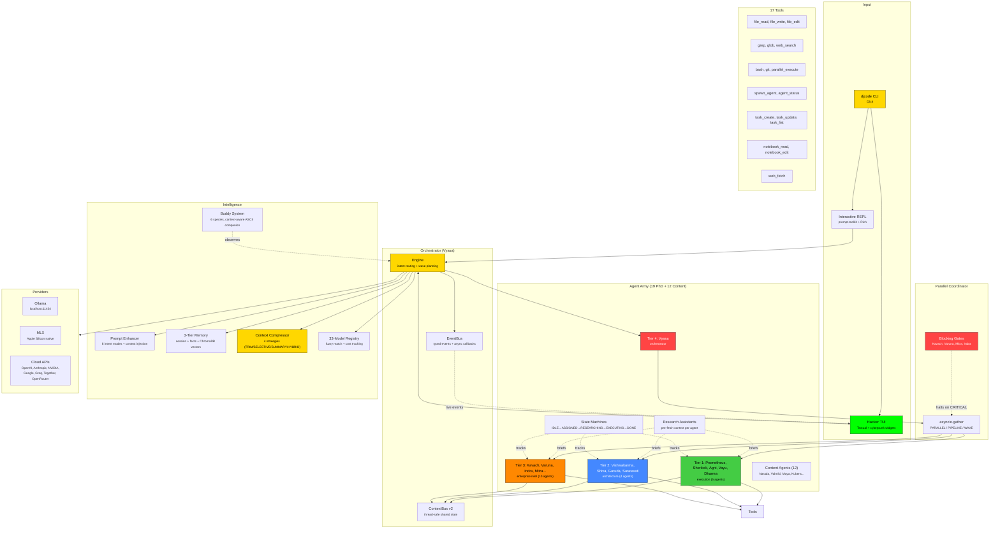

<div align="center">

```
  ██████╗      ██╗ ██████╗ ██████╗ ██████╗ ███████╗
  ██╔══██╗     ██║██╔════╝██╔═══██╗██╔══██╗██╔════╝
  ██║  ██║     ██║██║     ██║   ██║██║  ██║█████╗
  ██║  ██║██   ██║██║     ██║   ██║██║  ██║██╔══╝
  ██████╔╝╚█████╔╝╚██████╗╚██████╔╝██████╔╝███████╗
  ╚═════╝  ╚════╝  ╚═════╝ ╚═════╝ ╚═════╝ ╚══════╝
```

### 19 PhD agents. 17 tools. 1M context. Zero telemetry.

The AI coding CLI that makes Claude Code sweat.

[](https://github.com/darshjme/djcode/releases)
[](https://python.org)
[](LICENSE)
[](#install)
[](#install)
[](#privacy)
[](https://cli.darshj.ai)

[Install](#install) · [Why](#why) · [Features](#features) · [Demo](#demo) · [Agents](#agents) · [Tools](#tools) · [Models](#models) · [Architecture](#architecture) · [Website](https://cli.darshj.ai)

</div>

---

## Install

One line. No package manager. No config files. Just paste and go.

```bash
curl -fsSL https://cli.darshj.ai/install.sh | bash
```

That's it. You have a full AI coding agent running locally.

<details>
<summary><b>Manual install (from source)</b></summary>

```bash
git clone https://github.com/darshjme/djcode
cd djcode
uv sync
uv run python -m djcode
```

**Requires:** Python 3.12+, [Ollama](https://ollama.com) with at least one model pulled (`ollama pull gemma4`).

</details>

---

## Why

I was paying $200/month for AI coding tools.

Every prompt I typed, every file I opened, every half-baked idea I explored -- all of it shipped to someone else's servers. I was renting access to my own thought process. And the moment I cancelled, it was gone. No local model. No offline fallback. Nothing.

I kept thinking: my MacBook has a GPU. Apple Silicon can run 7B-26B models natively in unified memory. Ollama exists. The models are open-weight and getting better every month. Why am I paying a subscription to run inference on hardware I already own?

So I stopped paying and started building.

DJcode is the result. Not a toy. Not a wrapper. A full-blown multi-agent coding system with 19 PhD-level specialists, 17 tools, parallel execution, a hacker TUI, smart context compression, and a model registry that tracks 33 LLMs across every major provider. It runs entirely on your machine. Zero cloud dependency for local use. Zero telemetry. Your code never leaves your disk unless you explicitly choose a cloud provider.

It took months of late nights. Debugging agent coordination at 2am. Getting parallel execution right with asyncio. Building a context compression engine that actually fits 1M tokens without losing signal. Designing a state machine so every agent has a lifecycle you can watch in real-time on a cyberpunk dashboard.

But now it exists. And it's free. And it runs on a MacBook.

-- **[Darsh J](https://darshj.ai)**, creator of [DarshjDB](https://github.com/darshjme/darshjdb) and [DarshJ.AI](https://darshj.ai)

---

## Demo

```
  ██████╗      ██╗ ██████╗ ██████╗ ██████╗ ███████╗
  ██╔══██╗     ██║██╔════╝██╔═══██╗██╔══██╗██╔════╝
  ██║  ██║     ██║██║     ██║   ██║██║  ██║█████╗
  ██║  ██║██   ██║██║     ██║   ██║██║  ██║██╔══╝
  ██████╔╝╚█████╔╝╚██████╗╚██████╔╝██████╔╝███████╗
  ╚═════╝  ╚════╝  ╚═════╝ ╚═════╝ ╚═════╝ ╚══════╝

  v4.0.0 · ollama/gemma4 · Apple Silicon · 100% local

  ┌────────────────────────────────┐
  │ lights your path. Let's code.  │       ,
  └────────────────────────────────┘      /|\
                                         (o*o)
                                         |___|
                                        /_____\
                                       Agni the Illuminated

  djcode> /orchestra build a JWT auth system with refresh rotation

  [Vyasa] routing to: Kavach → Prometheus → Agni (wave execution)

  ┌─ Wave 1 ─────────────────────────────────────────┐
  │ Kavach (Security)  ✓  0.94 confidence   2.1s     │
  │ Varuna (Risk)      ✓  0.91 confidence   1.8s     │
  └──────────────────────────────────────────────────┘

  ┌─ Wave 2 ─────────────────────────────────────────┐
  │ Prometheus (Coder) ✓  0.88 confidence   12.3s    │
  │ Agni (Tester)      ✓  0.92 confidence   8.7s     │
  └──────────────────────────────────────────────────┘

  ┌─ Wave 3 ─────────────────────────────────────────┐
  │ Dharma (Reviewer)  ✓  0.90 confidence   4.2s     │
  └──────────────────────────────────────────────────┘

  5 agents · 29.1s · 0 critical findings · auth.py + tests written
```

```bash
# One-shot mode
$ djcode "binary search in Rust"

# Pick your model
$ djcode --model qwen2.5-coder:7b "optimize this SQL query"

# Uncensored mode (Dolphin 3)
$ djcode --model dolphin3 --bypass-rlhf "reverse engineer this binary"

# Cloud provider when you want it
$ djcode --provider anthropic --model claude-sonnet-4-20250514 "review my PR"

# Multi-agent orchestration
$ djcode "/orchestra deploy this service with full security review"
```

---

## Features

### 19 PhD-Level Dev Agents + 12 Content Agents

Not chatbots. Specialists. Each agent has a strict system prompt, scoped tool access (least-privilege), a mandatory confidence score, and a dharmic name. They run in parallel, pipeline, or wave execution patterns. Four blocking agents (Kavach, Varuna, Mitra, Indra) can halt the entire pipeline on critical findings.

Every PhD agent gets a **Research Assistant** that pre-fetches codebase context, searches the ContextBus, and builds a structured briefing *before* the agent starts. No wasted tool rounds on reconnaissance.

Quality gate: `confidence_score >= 0.80` or the output is rejected.

See the [full agent roster below](#agents).

### 17 Built-in Tools

The agents don't just talk. They act.

| Tool | What it does |
|------|-------------|
| `bash` | Execute shell commands with timeout and safety guards |
| `file_read` | Read files with line numbers (like `cat -n`) |
| `file_write` | Create or overwrite files |
| `file_edit` | Surgical string replacement in existing files |
| `grep` | Regex search across your codebase |
| `glob` | Find files by pattern |
| `git` | Git operations with built-in safety rails |
| `web_fetch` | Fetch content from URLs |
| `web_search` | Search the web for documentation, APIs, solutions |
| `task_create` | Create tracked tasks for multi-step work |
| `task_update` | Update task status, notes, completion |
| `task_list` | List and filter active tasks |
| `notebook_read` | Read Jupyter notebook cells and outputs |
| `notebook_edit` | Edit notebook cells programmatically |
| `spawn_agent` | Spawn a specialist agent for a sub-task |
| `agent_status` | Check status of spawned agents |
| `parallel_execute` | Run multiple tool calls concurrently |

The model decides which tools to use, chains them together, and loops until the task is done. Full agentic execution with confirmation prompts before anything destructive.

### 1M Context Window with Smart Compression

DJcode manages context windows up to 1M tokens (Claude Opus, Gemini Pro) with four compression strategies that activate automatically when you're running out of room:

| Strategy | How it works | LLM needed? |
|----------|-------------|:-----------:|
| **TRIM** | Drop oldest messages, keep system + recent N | No |
| **SELECTIVE** | Keep tool call/result messages, drop plain chat | No |
| **SUMMARY** | Replace old messages with LLM-generated summary | Yes |
| **HYBRID** | Summarize old chat, keep all tool interactions verbatim | Yes |

Plus: `tiktoken`-based token counting (with fallback estimation), extractive summarization without any LLM call, and pinned messages that survive all compression.

### 33-Model Registry with Cost Tracking

Every model in the registry carries: context size, tool support, vision support, thinking mode, provider, input/output cost per 1K tokens, and aliases for fuzzy matching. Type `opus` and it finds `claude-opus-4-6`. Type `gpt4o` and it finds `gpt-4o`.

Models from Anthropic, OpenAI, Google, Meta, Qwen, DeepSeek, Mistral, Microsoft, Cohere, xAI, NVIDIA. Local (Ollama/MLX) and cloud. Cost estimation built in: know what a request costs before you send it.

### Parallel Agent Execution

Five execution patterns, all with error isolation and blocking-agent gates:

| Pattern | How it works |
|---------|-------------|
| **SINGLE** | One agent, one task |
| **PARALLEL** | All agents run independently via `asyncio.gather` |
| **PIPELINE** | Sequential chain: output of A feeds into B |
| **WAVE** | Wave 1 runs in parallel, results feed Wave 2, repeat |
| **FULL_ARMY** | Vyasa orchestrates all 19 agents across waves |

If a blocking agent (Kavach, Varuna, Mitra, Indra) flags CRITICAL, remaining agents are cancelled. No code ships past security.

### Hacker TUI

Cyberpunk terminal dashboard built on Textual. Not a gimmick -- it's how you monitor 19 agents running in parallel.

- **MatrixRain** -- animated falling green characters
- **AgentStatusBar** -- all 19 agents with live state indicators (IDLE/ASSIGNED/RESEARCHING/EXECUTING/REVIEWING/DONE/ERROR)
- **HackerHeader** -- military HUD top bar with system telemetry
- **TokenBurnRate** -- real-time ASCII sparkline of token consumption
- **ContextBar** -- context window utilization meter
- **ThreatPanel** -- blocking agent alerts from Kavach, Varuna, Mitra, Indra
- **ArmyView** -- bird's eye grid of all agents, color-coded by tier

### Agent State Machine with Event Streaming

Every agent execution follows a strict lifecycle:

```
IDLE → ASSIGNED → RESEARCHING → EXECUTING → REVIEWING → DONE
                                                    ↘ ERROR
```

Each state transition emits an `AgentEvent` via async callbacks. The TUI, logging, and any custom integration can subscribe. Events: `STATE_CHANGE`, `TOKEN`, `TOOL_CALL`, `TOOL_RESULT`, `RA_BRIEFING`, `QUALITY_SCORE`, `ERROR`, `COMPLETE`.

### ContextBus v2

Thread-safe shared state for multi-agent execution. When agents run in parallel, they share findings through the bus:

- Typed entries (code, plan, review, security_audit, risk_assessment...)
- Priority levels for prompt injection ordering
- Agent attribution and timestamps
- Conflict detection (two agents writing the same key)
- Versioned history (all writes retained)
- Event emission on write (TUI updates live)
- asyncio.Lock for thread-safety under parallel execution

### EventBus for Real-Time Updates

Full orchestrator event system: `OrchestratorStartEvent`, `AgentStartEvent`, `AgentTokenEvent`, `AgentToolCallEvent`, `AgentCompleteEvent`, `BlockingGateEvent`, `SynthesisEvent`, `OrchestratorCompleteEvent`. Every event typed, timestamped, and subscribable via async callbacks.

### 9 Providers

Use whatever you want. Local or cloud. Switch on the fly.

| Provider | Type | Models |
|----------|------|--------|
| **Ollama** | Local | Gemma 4, Qwen 3, DeepSeek R1, Llama 4, Dolphin 3, any Ollama model |
| **MLX** | Local | Apple Silicon native via MLX framework |
| **OpenAI** | Cloud | GPT-4o, o3, o4-mini |
| **Anthropic** | Cloud | Claude Opus 4, Sonnet 4, Haiku 3.5 |
| **NVIDIA NIM** | Cloud | Nemotron Ultra, DeepSeek, Kimik2, GLM |
| **Google AI** | Cloud | Gemini 2.5 Pro, Gemini 2.5 Flash |
| **Groq** | Cloud | Ultra-fast inference |
| **Together AI** | Cloud | Open-weight models at scale |
| **OpenRouter** | Cloud | Unified API, any model |

Local is the default. Cloud is opt-in. Your choice.

### 3-Tier Memory

DJcode remembers. Across sessions. Without a cloud database.

```
Tier 1: Session Memory
       In-process conversation context. Fast. Ephemeral.

Tier 2: Persistent Facts
       Key-value store at ~/.djcode/memory/facts.json
       Survives restarts. You control what's stored.
       /remember, /recall, /forget

Tier 3: Semantic Search
       ChromaDB embeddings stored locally.
       Vector similarity search over your past conversations and facts.
       Finds relevant context even when you don't remember the exact words.
```

### Smart Prompt Enhancer

You type `fix the login bug`. DJcode sees:

| What it detects | What it injects |
|----------------|-----------------|
| Intent: **debug** | Structured debugging approach instructions |
| Working directory: `~/projects/myapp` | Full cwd path for file resolution |
| Git branch: `feature/auth` | Branch name + dirty/clean status |
| Project type: FastAPI + React | Framework-aware context |

The model gets a richer prompt. You get a better answer. Eight intent modes: debug, build, test, refactor, explain, review, deploy, git.

### Uncensored Mode

```bash
djcode --model dolphin3 --bypass-rlhf
```

For security research, pentesting, CTF challenges, reverse engineering. Uses uncensored models (Dolphin 3) that don't refuse valid technical requests. The `--bypass-rlhf` flag adjusts the system prompt to remove alignment restrictions.

This is a tool for professionals. Use it like one.

---

<h2 id="agents">Agents</h2>

### The 19 PhD Dev Agents (4-Tier Architecture)

```
TIER 4 — CONTROL
  Vyasa          PhD Chief Orchestrator         [ALL TOOLS]  [BLOCKING]

TIER 3 — ENTERPRISE INTELLIGENCE
  Kavach         Security & Compliance          [ALL TOOLS]  [BLOCKING]
  Varuna         Risk Engine Specialist          [ALL TOOLS]  [BLOCKING]
  Indra          Site Reliability Engineer       [ALL TOOLS]  [BLOCKING]
  Mitra          Legal & Contract Intelligence   [READ-ONLY]  [BLOCKING]
  Chanakya       Product Strategist              [READ-ONLY]
  Aryabhata      Data & AI Scientist             [ALL TOOLS]
  Kubera         Cloud Cost Optimizer            [READ + BASH]
  Hermes         Integration Specialist          [ALL TOOLS]
  Kamadeva       UX & Workflow Designer          [READ-ONLY]

TIER 2 — ARCHITECTURE
  Vishwakarma    Systems Architect               [READ-ONLY]
  Shiva          Refactoring Specialist          [ALL TOOLS]
  Garuda         Recon Agent                     [READ-ONLY]
  Saraswati      Technical Writer                [ALL TOOLS]

TIER 1 — EXECUTION
  Prometheus     Senior Full-Stack Engineer      [ALL TOOLS]
  Sherlock       Root Cause Analyst              [ALL TOOLS]
  Agni           QA Engineer                     [ALL TOOLS]
  Vayu           DevOps Engineer                 [ALL TOOLS]
  Dharma         Code Reviewer                   [READ-ONLY]
```

Four **blocking agents** (Kavach, Varuna, Mitra, Indra) can halt any pipeline if they flag CRITICAL findings. Security > Compliance > Correctness > Performance > Style.

### The 12 Content Agents

Built-in content generation army for marketing, social, video, and distribution:

```
  Narada         Campaign Director
  Valmiki        Script Writer
  Chitragupta    Social Media Strategist
  Maya           Image Prompter (Midjourney/DALL-E/Flux/SD)
  Kubera         Video Director (Runway/Kling/Sora)
  Tvastar        ComfyUI Workflow Architect
  Gandharva      Audio/Music Prompter (Suno/Udio)
  Brihaspati     SEO Analyst
  Saraswati      Brand Voice Writer
  Vishvakarma    Thumbnail Designer
  Hanuman        Content Repurposer
  Garuda         Trend Scout
```

---

## Meet Your Buddy

Every DJcode user gets a dharmic ASCII companion. Deterministically assigned from your username. Six species, each with 3 animation frames, idle fidgets, and contextual speech bubbles.

```
  ┌────────────────────────────────┐
  │ python code dropped. Looks     │       ,
  │ clean.                         │      /|\
  └────────────────────────────────┘     (o*o)
                                         |___|
                                        /_____\
                                    Agni the Illuminated
```

### The Six Species

```
     ,           _/\_       .-"-.       ~~~~~~      \|/|\|/       ॐ
    /|\         / oo \     / o|o \      |    |       (oo)        / \
   (o*o)        \ ~~ /    (  -o-  )     | oo |       /||\      |o.o|
   |___|         |  |      \ | /        |    |      / || \      \ /
  /_____\        \__/       ~~~~~       \____/       _/\_        ~

   Diya         Cobra       Lotus        Chai      Peacock       Om
  (oil lamp)   (guardian)   (bloom)     (teacup)   (display)   (cosmic)
```

The buddy watches what's happening: detects languages, tracks file changes, notices error streaks, celebrates momentum, reacts to fixes, observes tool usage, knows when you're idle.

---

## Models

DJcode ships with a 33-model registry spanning every major provider. Fuzzy matching built in.

### Local Models (Ollama)

| Model | Context | Best For | Tool Calling | Thinking |
|-------|---------|----------|:------------:|:--------:|
| `gemma4` | 32K | General coding (default) | Yes | Yes |
| `qwen3` | 128K | Reasoning + code | Yes | Yes |
| `qwen2.5-coder:7b` | 32K | Fast coding tasks | Yes | No |
| `deepseek-r1` | 128K | Deep reasoning | Yes | Yes |
| `llama4` | 10M | Massive context | Yes | No |
| `dolphin3` | 4K | No refusals, pentesting | No | No |

### Cloud Models

| Model | Context | Provider | Cost (in/out per 1K) |
|-------|---------|----------|---------------------|
| `claude-opus-4-6` | 1M | Anthropic | $0.015 / $0.075 |
| `claude-sonnet-4-6` | 1M | Anthropic | $0.003 / $0.015 |
| `gpt-4o` | 128K | OpenAI | $0.0025 / $0.01 |
| `o3` | 200K | OpenAI | $0.01 / $0.04 |
| `gemini-2.5-pro` | 1M | Google | $0.00125 / $0.01 |
| `grok-3` | 131K | xAI | $0.003 / $0.015 |

```bash
# Pull local defaults
ollama pull gemma4
ollama pull qwen2.5-coder:7b

# Switch models mid-session
djcode> /model opus
djcode> /model gemini-flash
```

---

## Commands

### CLI Flags

| Flag | Description | Default |
|------|-------------|---------|
| `--model, -m` | Model name (fuzzy matched) | `gemma4` |
| `--provider, -p` | Provider | `ollama` |
| `--bypass-rlhf` | Unrestricted expert mode | off |
| `--raw` | No Rich formatting (pipe-friendly) | off |
| `--auto-accept` | Skip tool confirmation prompts | off |
| `--version` | Print version and exit | -- |

### REPL Slash Commands

| Command | What it does |
|---------|-------------|
| `/help` | Show all available commands |
| `/model` | Interactive model picker (fuzzy match) |
| `/model <name>` | Switch model directly |
| `/models` | List all 33 models with context sizes and costs |
| `/provider` | Interactive provider picker |
| `/auth` | Configure provider API keys |
| `/auto` | Toggle auto-accept for tool calls |
| `/scout <query>` | Read-only codebase exploration (Garuda) |
| `/architect <task>` | Generate an implementation plan (Vishwakarma) |
| `/orchestra <task>` | Multi-agent orchestrated execution (Vyasa) |
| `/uncensored` | Show uncensored model info |
| `/memory` | Show memory stats (all 3 tiers) |
| `/remember k=v` | Store a persistent fact |
| `/recall <key>` | Recall a stored fact |
| `/forget <key>` | Remove a stored fact |
| `/clear` | Clear conversation history |
| `/save` | Save conversation to disk |
| `/config` | Show current configuration |
| `/set k=v` | Set a config value |
| `/buddy` | Show your ASCII buddy |
| `/buddy pet` | Pet your buddy |
| `/buddy species` | Show all six species |
| `/raw` | Toggle raw output mode |
| `/exit` | Exit DJcode |

---

## Architecture



---

## Project Structure

```
src/djcode/
├── cli.py                  # Click entry point
├── repl.py                 # Interactive REPL (prompt-toolkit + Rich)
├── provider.py             # 9 providers, auto-fallback, fuzzy model matching
├── prompt.py               # Expert system prompt with tool definitions
├── prompt_enhancer.py      # Intent detection (8 modes) + context injection
├── buddy.py                # ASCII buddy: 6 species, smart observer
├── config.py               # ~/.djcode/config.json management
├── auth.py                 # Provider registry + API key management
├── status.py               # Fixed bottom toolbar
├── onboarding.py           # First-run wizard
├── updater.py              # Auto-update checker
├── tui.py                  # Main Textual TUI app
├── tui_hacker.py           # Cyberpunk widgets (MatrixRain, AgentHUD, ThreatPanel)
├── tui_panels.py           # Panel components for dashboard
├── tui_theme.py            # Color system (gold, matrix green, tier colors)
├── context_engine.py       # Context window management
├── tools/
│   ├── bash.py             # Shell execution with timeout
│   ├── file_read.py        # Read with line numbers
│   ├── file_write.py       # Create/overwrite files
│   ├── file_edit.py        # Surgical string replacement
│   ├── grep.py             # Regex search across codebase
│   ├── glob.py             # File pattern matching
│   ├── git.py              # Git operations with safety guards
│   ├── web_fetch.py        # URL content fetching
│   ├── web_search.py       # Web search for docs and solutions
│   ├── task_tracker.py     # Task creation, update, listing
│   ├── notebook.py         # Jupyter notebook read/edit
│   ├── agent_spawn.py      # Spawn specialist sub-agents
│   └── parallel_exec.py    # Concurrent tool execution
├── agents/
│   ├── registry.py         # 19 PhD agent specs (4-tier, dharmic names)
│   ├── content_registry.py # 12 content specialist agents
│   ├── executor.py         # Agent execution engine
│   ├── parallel.py         # ParallelCoordinator (gather/pipeline/wave)
│   ├── state.py            # Agent state machine + event streaming
│   ├── ra.py               # Research Assistant framework
│   ├── operator.py         # General-purpose agent with tool-calling loop
│   ├── scout.py            # Read-only exploration agent
│   └── architect.py        # Planning and design agent
├── orchestrator/
│   ├── engine.py           # Vyasa orchestration engine
│   ├── router.py           # Intent → agent routing
│   ├── context_bus.py      # ContextBus v2 (thread-safe, typed, versioned)
│   ├── events.py           # Typed event system for TUI integration
│   └── vector_context.py   # Vector-based context retrieval
├── context/
│   ├── manager.py          # Context window manager
│   ├── compressor.py       # 4 compression strategies
│   └── models.py           # 33-model registry with fuzzy matching
├── memory/
│   ├── manager.py          # 3-tier memory (session + persistent + semantic)
│   └── embedder.py         # ChromaDB vectors + cosine similarity
└── providers/
    ├── base.py             # Provider base class
    ├── anthropic.py        # Anthropic (Claude) with prompt caching support
    ├── openai.py           # OpenAI-compatible
    ├── google.py           # Google AI (Gemini)
    └── router.py           # Provider selection and fallback
```

---

## Configuration

Config lives at `~/.djcode/config.json`. Created automatically on first run by the onboarding wizard.

```json
{
  "provider": "ollama",
  "model": "gemma4",
  "ollama_url": "http://localhost:11434",
  "temperature": 0.7,
  "max_tokens": 8192,
  "telemetry": false
}
```

Override anything with CLI flags or `/set` in the REPL.

---

<h2 id="privacy">Privacy</h2>

- `DO_NOT_TRACK=1` by default
- Zero analytics, zero phone-home, zero usage tracking
- All memory stored at `~/.djcode/` on your filesystem
- ChromaDB vectors stored locally, never uploaded
- Cloud providers are opt-in and explicit
- No account required. No sign-up. No email.

---

## How We Stack Up

| Feature | **DJcode v4.0** | Claude Code | Gemini CLI | Aider |
|---------|:---------------:|:-----------:|:----------:|:-----:|
| **Price** | **Free** | $20--200/mo | Free tier | Free + API |
| **Specialist agents** | **19 PhD + 12 content** | 1 generalist | 1 generalist | 1 generalist |
| **Parallel execution** | **5 patterns** | Sequential | Sequential | Sequential |
| **Tools** | **17** | ~15 | ~10 | ~8 |
| **Model registry** | **33 models, fuzzy match** | Claude only | Gemini only | Multi-provider |
| **Context compression** | **4 strategies** | Truncation | Truncation | Repo map |
| **Agent state machine** | **7 states, event streaming** | No | No | No |
| **Blocking security gates** | **4 agents** | No | No | No |
| **Research Assistants** | **Per-agent RA** | No | No | No |
| **Hacker TUI** | **Cyberpunk dashboard** | Basic terminal | Basic terminal | Basic terminal |
| **Local inference** | **Native (Ollama + MLX)** | No | No | Workaround |
| **Apple Silicon** | **Native** | No | No | No |
| **Zero telemetry** | **By design** | Opt-out | Opt-out | Opt-in |
| **Works offline** | **Yes** | No | No | No |
| **Cost tracking** | **Per-model** | Session total | No | No |
| **3-tier memory** | **Session + facts + vectors** | CLAUDE.md | GEMINI.md | No |
| **Open source** | **MIT** | Source-avail | Apache 2.0 | Apache 2.0 |

> DJcode is the only AI coding CLI with parallel PhD-level agents, blocking security gates, and full offline operation on Apple Silicon.

---

## Development

```bash
git clone https://github.com/darshjme/djcode
cd djcode
uv sync

# Run
uv run python -m djcode

# Test
uv run pytest tests/ -v

# Lint + format
uv run ruff check src/ && uv run ruff format src/
```

---

## Related

- **[DarshjDB](https://github.com/darshjme/darshjdb)** -- Backend-as-a-Service in Rust. Local-first database engine.
- **[DarshJ.AI](https://darshj.ai)** -- AI tools, infrastructure, and open-source projects.
- **[cli.darshj.ai](https://cli.darshj.ai)** -- DJcode project website.

---

## License

MIT -- see [LICENSE](LICENSE).

---

<div align="center">

<br/>

*I built this because I believe the best dev tools run on your own hardware.*
*No subscriptions. No data harvesting. Just you, your code, and 19 PhD agents that work for free.*

<br/>

**[DarshJ](https://darshj.ai)** · Built on Apple Silicon · Open source forever

<br/>

<sub>If DJcode saves you from a cloud subscription, star the repo. That's all I ask.</sub>

</div>
