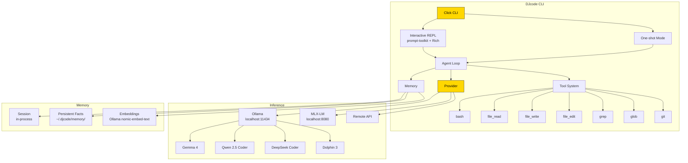

<div align="center">

```
██████╗      ██╗ ██████╗ ██████╗ ██████╗ ███████╗
██╔══██╗     ██║██╔════╝██╔═══██╗██╔══██╗██╔════╝
██║  ██║     ██║██║     ██║   ██║██║  ██║█████╗  
██║  ██║██   ██║██║     ██║   ██║██║  ██║██╔══╝  
██████╔╝╚█████╔╝╚██████╗╚██████╔╝██████╔╝███████╗
╚═════╝  ╚════╝  ╚═════╝ ╚═════╝ ╚═════╝ ╚══════╝
```

**The last coding CLI you'll ever need.**

Local-first AI coding agent. No cloud. No subscription. No telemetry. Pure Apple Silicon power.

[](https://github.com/darshjme/djcode-python/releases)
[](https://python.org)
[](LICENSE)
[](#install)

[Install](#install) · [Models](#models) · [Commands](#commands) · [Architecture](#architecture) · [Website](https://cli.darshj.ai)

</div>

---

## Why DJcode?

I was tired of paying $200/month for AI coding tools that sent every keystroke to someone else's servers. Every file, every thought, shipped to a data center.

So I built DJcode.

It runs entirely on your machine. Ollama serves models like Gemma 4, Qwen 2.5 Coder, DeepSeek, and Dolphin 3 — all on Apple Silicon's unified memory. No API keys for local use. No subscriptions. No telemetry. Your code stays yours.

It took months of late nights. But now it exists — a full-featured AI coding agent that rivals the best cloud tools, running on a MacBook.

— **Darsh J**, creator of [DarshjDB](https://github.com/darshjme/darshjdb) and [DarshJ.AI](https://darshj.ai)

---

## Install

```bash
curl -fsSL https://cli.darshj.ai/install.sh | bash
```

Or manually:

```bash
git clone https://github.com/darshjme/djcode-python
cd djcode-python
uv sync && uv run python -m djcode
```

**Prerequisites:** Python 3.12+, [Ollama](https://ollama.com) with a model pulled.

---

## Quick Start

```bash
# Interactive REPL
djcode

# One-shot prompt
djcode "write a REST API with auth in FastAPI"

# Different model
djcode --model qwen2.5-coder:7b "binary search in Rust"

# Uncensored mode (Dolphin 3)
djcode --model dolphin3 --bypass-rlhf "reverse shell in Python"

# Raw output (pipe-friendly)
djcode --raw "explain this error" 2>/dev/null
```

---

## Models

DJcode works with any Ollama model. Tested and recommended for M1/M2/M3/M4:

| Model | Size | Best For | Tool Calling | Uncensored |
|-------|------|----------|-------------|------------|
| `gemma4` | 9.6 GB | General coding (default) | ✅ | Mild |
| `qwen2.5-coder:7b` | 4.7 GB | Fast coding tasks | ✅ | Mild |
| `deepseek-coder-v2:lite` | 8.9 GB | Code generation | ✅ | Yes |
| `dolphin3` | 4.9 GB | No refusals, pentesting | ❌ | **Full** |
| `gemma4:26b` | 16 GB | Complex reasoning (32GB+ RAM) | ✅ | Mild |

```bash
# Pull models
ollama pull gemma4
ollama pull qwen2.5-coder:7b
ollama pull dolphin3
ollama pull deepseek-coder-v2:lite
```

**RAM guide:** 8GB → 7B models · 16GB → 7-12B models · 32GB → 26B MoE · 64GB+ → 70B+

---

## Features

- **100% Local** — Ollama + MLX, zero cloud dependency
- **7 Built-in Tools** — bash, file read/write/edit, grep, glob, git
- **3-Tier Memory** — session, persistent facts, semantic search via embeddings
- **Tool Calling** — models can execute tools autonomously (agentic loop)
- **3 Agent Types** — Operator (general), Scout (exploration), Architect (planning)
- **Streaming** — real-time token streaming with Rich formatting
- **Auto-Fallback** — if a model doesn't support tools, retries without them
- **Zero Telemetry** — `DO_NOT_TRACK=1`, no analytics, no phone-home
- **`--bypass-rlhf`** — unrestricted expert mode for advanced use
- **12+ Slash Commands** — /model, /provider, /memory, /remember, /recall, /clear, /save

---

## REPL Commands

| Command | Description |
|---------|-------------|
| `/help` | Show all commands |
| `/model <name>` | Switch model (e.g. `/model dolphin3`) |
| `/provider <p>` | Switch provider (ollama, mlx, remote) |
| `/memory` | Show memory stats |
| `/remember k=v` | Store a persistent fact |
| `/recall <key>` | Recall a fact |
| `/forget <key>` | Remove a fact |
| `/clear` | Clear conversation |
| `/save` | Save conversation to disk |
| `/config` | Show current configuration |
| `/set k=v` | Change a config value |
| `/raw` | Toggle raw output mode |
| `/exit` | Exit |

---

## CLI Flags

| Flag | Description | Default |
|------|-------------|---------|
| `--model, -m` | Model name | `gemma4` |
| `--provider, -p` | Provider (ollama/mlx/remote) | `ollama` |
| `--bypass-rlhf` | Unrestricted expert mode | off |
| `--raw` | No Rich formatting (pipe-friendly) | off |
| `--config` | Show config and exit | — |
| `--version` | Show version | — |

---

## Architecture



---

## Project Structure

```
djcode-python/
├── src/djcode/
│   ├── cli.py           # Click CLI entry point
│   ├── repl.py          # Interactive REPL with streaming
│   ├── provider.py      # Ollama/MLX/Remote with auto-fallback
│   ├── prompt.py        # Hardened expert system prompt
│   ├── config.py        # ~/.djcode/config.json management
│   ├── tools/           # 7 built-in tools
│   │   ├── bash.py      # Shell execution with timeout
│   │   ├── file_read.py # Read with line numbers
│   │   ├── file_write.py# Create/overwrite files
│   │   ├── file_edit.py # Surgical string replacement
│   │   ├── grep.py      # Regex search (ripgrep)
│   │   ├── glob.py      # File pattern matching
│   │   └── git.py       # Git ops with safety guards
│   ├── memory/          # 3-tier memory system
│   │   ├── manager.py   # Session + persistent + semantic
│   │   └── embedder.py  # Ollama embeddings + cosine sim
│   └── agents/          # Agent types
│       ├── operator.py  # General-purpose with tool loop
│       ├── scout.py     # Read-only exploration
│       └── architect.py # Planning and design
├── tests/
│   └── test_cli.py      # 35 tests
├── pyproject.toml
├── LICENSE
└── README.md
```

---

## Configuration

Config lives at `~/.djcode/config.json`:

```json
{
  "provider": "ollama",
  "model": "gemma4",
  "ollama_url": "http://localhost:11434",
  "temperature": 0.7,
  "max_tokens": 8192,
  "telemetry": false
}
```

---

## Development

```bash
git clone https://github.com/darshjme/djcode-python
cd djcode-python
uv sync
uv add --dev pytest ruff

# Run
uv run python -m djcode

# Test
uv run pytest tests/ -v

# Lint + format
uv run ruff check src/ && uv run ruff format src/
```

---

## Related

- [DarshjDB](https://github.com/darshjme/darshjdb) — Backend-as-a-Service in Rust
- [DarshJ.AI](https://darshj.ai) — AI tools and infrastructure

---

## License

MIT — see [LICENSE](LICENSE).

---

<div align="center">
<sub>Built with ❤️ by <a href="https://darshj.ai">DarshJ</a> on Apple Silicon</sub>
</div>
