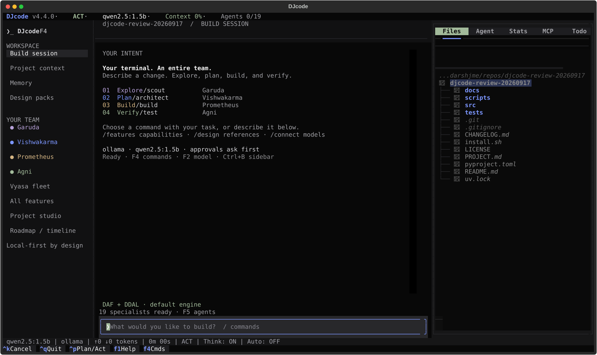
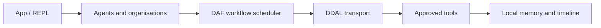

# DJcode

Local-first coding agent for the terminal. Version **4.4.0**. Python 3.12+. MIT.

DJcode runs a model you choose — Ollama, MLX, or a hosted OpenAI-compatible provider — against your working tree. It can read and edit files, run shell and Git commands, call specialist profiles, and keep sessions on disk. Tool auto-accept starts off. The installer does not download model weights.

[Website](https://cli.darshj.ai) · [Getting started](docs/INSTALLATION-AND-RECOVERY.md) · [Project studio](docs/PROJECT-STUDIO.md) · [Changelog](CHANGELOG.md) · [Issues](https://github.com/darshjme/djcode/issues)



## Build with your own team

Use the full-screen app or REPL to define agents, organise them into teams and run dependency workflows. Project studio saves definitions locally; the roadmap combines milestones with Git history and runtime events. `/finish` records completion only after doctor and your approved checks pass.

| Capability | Entry point |
| --- | --- |
| Project and code inspection | `/project`, `/scout`, `/build` |
| Custom agents and organisations | `/agent`, `/organisation`, Project studio |
| DAF scheduling and DDAL transport | `/flow`, `/workflow` |
| Persistent session memory and facts | `/memory`, `/remember`, `/recall` |
| Roadmap and development history | `/roadmap`, `/timeline` |
| Diagnostics and completion checks | `/doctor`, `/finish` |


```mermaid
flowchart LR
  UI[App / REPL] --> Team[Agents and organisations]
  Team --> DAF[DAF workflow scheduler]
  DAF --> DDAL[DDAL transport]
  DDAL --> Tools[Approved tools]
  Tools --> Memory[Local memory and timeline]
```

## Install

Requires git and Python 3.12+ (or a uv-managed Python). The default DAF engine also requires Cargo to build its bundled Rust runtime, or an existing binary selected with `DJCODE_DAF_ENGINE`.

```sh
curl -fsSL https://cli.darshj.ai/install.sh | bash
djcode --check
djcode --setup
```

`--setup` picks provider, authentication, and model. Ollama discovery uses `/api/tags`; it never pulls weights. Hosted providers need their documented API key in the environment.

From source:

```sh
git clone https://github.com/darshjme/djcode.git
cd djcode
uv sync
uv run python -m djcode --check
```

Managed installs live under `~/.local/share/djcode/` with `current` / `previous` release pointers. Managed updates verify the canonical source tag and wheel checksum; GitHub Actions is not required. Verify locally with `--check`, and use `--update-mode manual` or `disabled` if you do not want startup update checks.

```sh
djcode --update                 # install the latest managed build
djcode --rollback               # restore the previous managed build
djcode --update-mode manual     # only update when asked
djcode --no-update              # skip update checks this run
```

## Use

```sh
djcode                          # full-screen TUI
djcode --repl                   # line-oriented REPL
djcode "summarize this repo"    # one shot
djcode --design-packs           # list bundled design references
djcode --revision               # installed version without network
```

Config, memory and history: `~/.djcode/` (`DJCODE_CONFIG_DIR` overrides). Default provider is Ollama at `http://localhost:11434`, model `gemma4`. `auto_approve_tools` defaults to false.

### Vyasa fleet

DJcode can talk to a [Vyasa](https://github.com/darshjme/vyasa-agent) fleet on loopback:

```sh
export VYASA_URL=http://127.0.0.1:19000
# Set VYASA_TOKEN from `vyasa token` on the fleet host. Do not commit it.
djcode --vyasa
djcode --vyasa --vyasa-employee prometheus --vyasa-session review 'Review this release plan'
```

## Profiles and tools

**19 engineering profiles:** Vyasa, Prometheus, Sherlock, Agni, Vayu, Dharma, Vishwakarma, Shiva, Garuda, Saraswati, Chanakya, Kavach, Aryabhata, Indra, Kubera, Hermes, Kamadeva, Mitra, Varuna.

**12 content profiles:** Narada, Valmiki, Chitragupta, Maya, Kubera, Tvastar, Gandharva, Brihaspati, Saraswati, Vishvakarma, Hanuman, Garuda.

These are prompt and tool-policy names, not professional credentials.

**Tools the model can call:** `bash`, `file_read`, `file_write`, `file_edit`, `grep`, `glob`, `git`, `web_fetch`, `web_search`, `task_create`, `task_update`, `task_list`, `notebook_read`, `notebook_edit`, `parallel_execute`, `spawn_agent`, `agent_status`, `schedule`, plus capability dispatch for `skill`, `mcp`, `process`, `browser`, `computer`, and `workflow` when those extras are configured.

Optional extras: `computer` (Playwright / PyAutoGUI), `voice` (sounddevice), `tokens` (tiktoken).

## Development

```sh
uv sync
uv run python -m djcode --check
uv run --with pytest --with pytest-asyncio pytest -q
uv run ruff check src/djcode --select E9,F63,F7,F82
uv run python -m djcode --doctor
```

See [docs/INSTALLATION-AND-RECOVERY.md](docs/INSTALLATION-AND-RECOVERY.md), [docs/AGENT-WORKSPACE.md](docs/AGENT-WORKSPACE.md), and [docs/ACCOUNT-AUTH.md](docs/ACCOUNT-AUTH.md).

The 4.4 validation run passed 494 tests and 14 subtests, plus 12 release-helper tests. See [validation scope](docs/WEBSITE-PARITY.md) and [development timeline](docs/DEVELOPMENT-TIMELINE.md).

## Related

- [Vyasa Agent](https://github.com/darshjme/vyasa-agent) — self-hosted specialist fleet
- [DAF](https://github.com/darshjme/daf) — Rust agent-coordination libraries
- [DarshJDB](https://github.com/darshjme/darshjdb) — self-hosted backend and agent memory

Created by [Darshankumar Joshi](https://github.com/darshjme). Licensed under [MIT](LICENSE).

The app opens the website-style workspace on wide terminals; the REPL uses the same palette and commands. Start with `/features`, `/project`, `/design` or `/fleet`. See [website feature coverage and terminal controls](docs/WEBSITE-PARITY.md).

Project teams, dependency workflows, roadmap and completion checks: [Project studio](docs/PROJECT-STUDIO.md). Use `djcode --doctor` to verify memory and DAF/DDAL locally.
