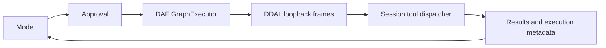

# Agent workspace

DJcode combines a conversation-first terminal with tools for coding, browsers, desktop interaction, skills, MCP servers, background processes and scheduled commands. Darshankumar Joshi maintains the project.

## Start

```sh
uv sync --extra computer
uv run --extra computer python -m playwright install chromium
uv run djcode
```

First run opens **Provider → Sign in → Model**. `/connect` opens it again. Model discovery and verification finish before configuration is saved; cancelling retains the previous configuration. OpenRouter browser login uses its documented PKCE flow: authorize in the browser, then paste the one-time code. API keys, local/custom endpoints and the existing approved-client xAI device flow remain available. This does not add ChatGPT or Claude subscription login.

DAF is the default tool engine. The first tool call builds the included, locked Rust sources using Cargo; subsequent calls reuse the cached executable. An installation can supply its built executable through `DJCODE_DAF_ENGINE`. Missing Cargo or a failed build produces an error; there is no silent fallback. `/workflow native` explicitly selects the older direct dispatcher; `/workflow daf` restores DAF.

## Execution



Normal operator and specialist tool calls use this path. The model's `workflow` tool accepts up to 32 nodes with IDs, tool names, literal argument objects and dependencies, with concurrency from 1 to 4. Dependencies wait for success; failures prevent dependent work. Each requested action retains its approval gate, including actions inside a workflow. Tool effects are never automatically retried. The Rust host validates transported requests and responses; Python verifies each dispatched request against the submitted graph.

This is a local integration of the repaired DAF graph and DDAL libraries. It is not the unfinished DAF distributed runtime, provisioning service or vault. Metadata in `workflows.db` records states and wire byte counts, without recording tool arguments or content.

## Terminal controls

- `/connect`, `/model`: connect and select a model; the conversation survives model switches.
- `/new`, `/fork`, `/session`, `/history`, `/resume`: save, branch and recover conversations. Forking creates a distinct session; UUIDs prevent same-second collisions.
- `/compact`: compact the model context.
- `/skill NAME`, `/skills`: load or discover skills. Supported locations are the configured `skills/*.skill.md`, `skills/*/SKILL.md`, and the workspace's `.djcode/skills/*/SKILL.md`.
- `/workflow`: show the selected engine and last run.
- `/jobs`, `/browser`, `/computer`, `/schedule`: inspect or invoke capabilities. Supply a JSON argument object for actions with multiple fields.
- TUI: Enter while a response runs queues a follow-up. `/queue` inspects it; `/queue clear` removes it. Cancel leaves queued work pending. Ctrl+B opens the optional sidebar.
- REPL: `djcode --repl` retains scrollback, completion, prompt history and interruptible responses.

## Computer and connector tools

The browser tool owns its Chromium tabs. It supports navigation, accessibility snapshots, selector clicks/fills, key presses and PNG screenshots. Screenshots are passed as actual image content to OpenAI-compatible, OpenAI, Anthropic, Gemini and Ollama adapters. Use a vision-capable model for screenshot reasoning.

The desktop tool uses PyAutoGUI for screenshots, coordinates, keys and scrolling. Its corner failsafe remains enabled. Desktop use requires the OS's accessibility/screen-recording permissions; ASCII typing is supported, while browser fill supports Unicode. No permission is granted by installing DJcode.

`mcp` lists configured servers, retrieves schemas and calls their tools. Servers start lazily after tool approval. The stdio client performs the initialized handshake, skips notifications, rejects unsupported server requests and closes processes on cancellation/shutdown. Messaging and other application integrations require their configured MCP servers and accounts; they are not bundled service connections.

## Background and scheduled work

`process` starts, reads and stops bounded background shell jobs. Delayed process jobs belong to the active session and stop when it closes. Eight active jobs and 32,000 characters of retained output per job are the limits.

`schedule` persists commands, working directories, due times and optional recurrence in SQLite. Creation authorizes the exact future command. Run the worker explicitly on the machine that owns the workspace:

```sh
djcode --scheduler
```

Use a service manager on a server for persistent operation. DJcode does not silently install or launch a daemon. The worker claims jobs transactionally, executes through DAF/DDAL and retains results. A failure or interruption stops recurrence; it does not automatically replay possible side effects. A hard-crashed claimed job remains visibly `running` for inspection and is not reclaimed automatically.

## Verification boundaries

The test suite covers actual DAF/DDAL execution, ordering, failures, cancellation, MCP stdio, PKCE exchange fixtures, session recovery, screenshot payload conversion, scheduled execution and UI onboarding. A real isolated Chromium fixture verifies browser actions and screenshot delivery. Production provider inference, real account authorization and OS desktop permissions require separate acceptance with the user's accounts and machine.

Design references: [Pi's coding-agent workflow](https://github.com/earendil-works/pi/blob/main/packages/coding-agent/README.md), [OpenCode provider setup](https://opencode.ai/docs/providers), [OpenClaw tools](https://docs.openclaw.ai/tools), [OpenRouter PKCE](https://openrouter.ai/docs/guides/overview/auth/oauth), [Playwright](https://playwright.dev/python/docs/api/class-page), and [PyAutoGUI](https://pyautogui.readthedocs.io/en/latest/quickstart.html). The terminal implementation and styling are DJcode's own.
