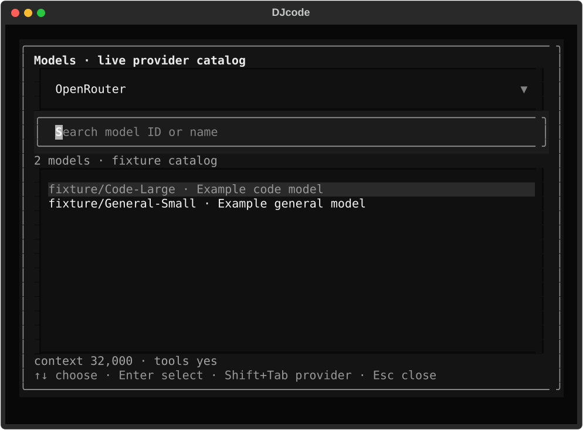
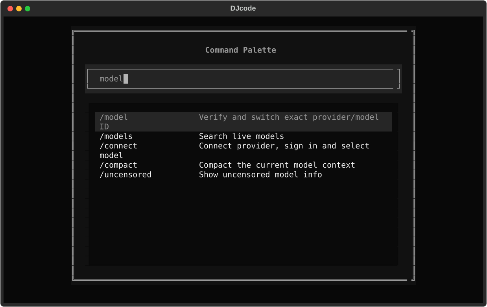

# Connect, choose a model and keep DJcode healthy

Created by Darshankumar Joshi. These commands run without starting inference.
Use `--json` for structured output and process exit codes. Failed checks return
nonzero; a missing connection never appears as a successful model discovery.

## Authentication

```sh
djcode auth list
djcode auth status openai --json
djcode auth login openai
djcode auth login openrouter --method browser
djcode auth login ollama
djcode auth logout openai
```

Login prompts hide API keys. Automation can supply a key through standard input
with `--key-stdin`; keys are not accepted as command-line arguments. API keys are
stored atomically in DJcode settings with owner-only permissions. Login leaves
the selected provider/model unchanged until you explicitly choose a model.
Status reports the credential source and available methods without credentials
or token values. Locally configured credentials are not proof of provider access.

Stored provider credentials take precedence over environment credentials. Account
mode is explicit and does not silently fall back to an API key. Logout removes
only the chosen provider’s saved credentials. Environment keys and upstream grants
remain under your control; status explains a remaining environment credential.
Damaged settings are preserved and must be repaired before credential mutations.

OpenRouter browser sign-in uses PKCE. xAI device sign-in is available only with
an xAI-approved DJcode public client registration; ordinary installations offer
API keys. OpenAI and Anthropic integrations use API keys. Subscription reuse is
not implied by the command interface. See [account authentication](ACCOUNT-AUTH.md)
for protocol details and the verified integration limits.

## Models

```sh
djcode models ollama
djcode models openai --json
djcode models --select openai/MODEL_ID
```

Replace `MODEL_ID` with an exact ID from discovery. Provider/model selection
validates the pair before saving. For IDs containing a slash, an explicit provider
also works: `djcode models openrouter --select PROVIDER_MODEL_ID`. IDs preserve
their case. Changing providers clears stale global endpoint/model settings and
preserves unrelated credentials. Failed selection preserves the previous settings.

The full-screen app offers a searchable model dialog through **F2** or `/model`,
and connection settings through **F3** or `/provider`. Successful runtime changes
retain the session conversation; failed changes retain the previous runtime.
Model/provider changes wait for active generation to finish or be cancelled.
The catalog reports its source and readiness. Capability details come from
provider metadata; missing capabilities remain unknown. Discovery does not
download model weights or prove the quality of model inference.

First-run setup can explicitly save an offline or discovery-unsupported
configuration for later use after confirmation. Runtime model switching still
requires a ready catalog and a validated selection.



## Updates and lint

```sh
djcode update --status --json    # offline installation and mode status
djcode update --check --json     # check without installing
djcode update --check --refresh # bypass the check cache
djcode update --mode manual
djcode update                  # explicit managed installation
djcode update --rollback
djcode lint . --json
djcode doctor --quick
```

Status identifies managed, pip, uv or editable-source installation ownership and
shows the appropriate update command. Managed installation verifies the canonical
manifest, source tag and artifact checksum, stages the new runtime, and checks it
before activation. Rollback validates the previous executable before activation.
See [installation and recovery](INSTALLATION-AND-RECOVERY.md).

Automatic mode allows startup update behavior. Manual mode permits an explicit
check or installation. Disabled mode and `DJCODE_NO_UPDATE_CHECK` prevent update
checks even with `--refresh`. Checks cache results for 24 hours, including an
explicit unavailable result on network failure. A failed check does not claim that
the installation is current. Offline status and doctor do not fetch update metadata.
Individual pointer replacements are atomic; multiple files are not one transaction
against a process kill between writes.

Lint runs fatal Ruff rules (`E9,F63,F7,F82`) and reports locations, diagnostics and
failure status. It checks the installation when no path is supplied. It neither
changes files nor installs Ruff; dependency/path failures give an actionable report.
Legacy flags such as `--update`, `--rollback` and `--lint` remain available.

## Full-screen controls

| Action | Control |
| --- | --- |
| Search commands and operations | Ctrl+P or F4 |
| Discover all shortcuts | F1 or `/hotkeys` |
| Choose an exact provider/model pair | F2 or `/model` |
| Connect a provider | F3 or `/provider` |
| Toggle Plan/Act | Ctrl+G or `/plan` |
| Open Project studio | Ctrl+E |
| Toggle sidebar / reach its tabs | Ctrl+B / F6 then Left or Right |
| Cancel active work | Ctrl+K or `/cancel` |
| Close a dialog | Escape |
| Quit | Ctrl+Q or `/exit` |

The [terminal guide](TERMINAL-INTERACTION.md) distinguishes REPL input bindings
from full-screen operations. `/auth status`, `/update status`, `/update check`
and `/lint` expose maintenance inside the app. Update installation is explicit.
To send a one-shot prompt consisting of a reserved CLI command name, use
`djcode -- auth` (or the corresponding word).



These captures show mounted Textual dialogs: the model picker at 80×28 and the
command palette at 100×30. The model catalog uses labeled fixtures; the captures
do not demonstrate hosted model access. Selecting a palette entry fills the
prompt for review; press Enter again to submit it.

The interface references were the official [OpenCode CLI](https://opencode.ai/docs/cli/),
[OpenCode model guide](https://opencode.ai/docs/models/),
[Claude Code setup](https://code.claude.com/docs/en/setup) and
[Pi keybindings](https://pi.dev/docs/latest/keybindings). DJcode’s actual behavior
is documented above and tested in this repository.
