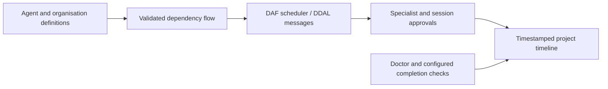

# Project studio

DJcode 4.4 shares persistent project definitions across the Textual app and REPL.
Open **Project studio** in the app navigation to edit JSON templates, load saved
definitions, save them, or run a saved flow. Slash commands work in both interfaces.
Definitions and timestamped events live in a project-specific SQLite database under
DJcode's configuration directory. Changing a definition does not start a task.

Create an agent, an organisation, and a dependency workflow in this order:

```text
/agent save {"name":"reviewer","role":"scout","prompt":"Inspect code and report concrete issues."}
/organisation save {"name":"engineering","agents":["reviewer"]}
/flow save {"name":"review","organisation":"engineering","concurrency":1,"nodes":[{"id":"inspect","agent":"reviewer","task":"Inspect the project"},{"id":"report","agent":"reviewer","task":"Summarize the findings","dependencies":["inspect"]}]}
/flow run review
```

Use `list` and `show NAME` with each definition command. Flows validate missing
agents, organisation membership, dependency cycles and concurrency (1–4). Agents
inherit their base role's policy and can restrict its tools further. They use the
connected provider, share context, and ask through the current session's tool
approval callback. Plan mode blocks saves and execution. DAF schedules nodes;
DDAL carries the engine protocol. A failed dependency blocks its dependents.



Track planned work and inspect its history:

```text
/roadmap save {"name":"release","description":"Ship the reviewed changes","status":"in_progress"}
/timeline
/doctor
/finish {"checks":["uv run ruff check src/djcode --select E9,F63,F7,F82","uv run --with pytest pytest -q"]}
```

Roadmap statuses are `planned`, `in_progress`, `blocked` and `done`. They are user
reports. The timeline separately shows Git history and runtime events, including
the DJcode version that recorded them. `/finish` records completion only if doctor
and every explicitly configured, approved check succeeds. A denial is a failed
check. This certifies those checks, not universal correctness. Event records store
statuses rather than raw command output or credentials.

`djcode --doctor` needs no model. It checks Python syntax, runtime registries,
fatal lint, session-memory reopening and a real DAF/DDAL echo roundtrip. Cargo or a
configured DAF engine is required for that roundtrip. `/update` and `djcode --update`
retain the existing verified managed-update path; doctor never updates software.

Memory remains local: SQLite conversations, durable facts and optional explicitly
supplied embeddings. Lexical fact search works without an embedding service. See
[installation and recovery](INSTALLATION-AND-RECOVERY.md) and
[development history](DEVELOPMENT-TIMELINE.md).
