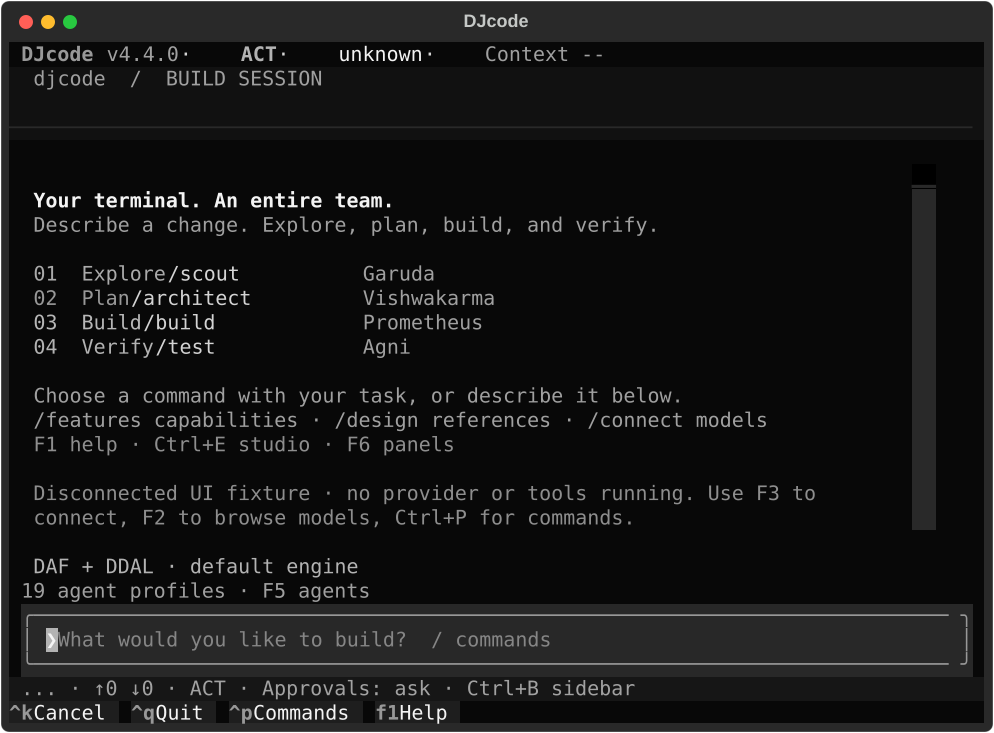
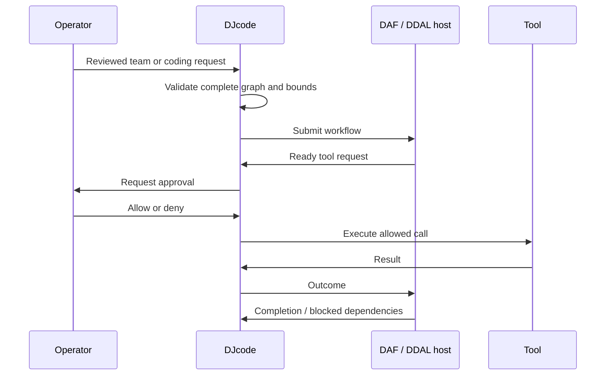

# Coding teams and terminal operation

Created by Darshankumar Joshi. DJcode combines a coding loop, session approvals,
saved specialist definitions and a local Rust workflow engine. A model proposes
work; the operator decides which tool effects to allow and which results to trust.



The capture uses a disconnected fixture session with no live provider. It shows
the actual Textual interface rather than an invented screen or usage statistics.
The wide capture in the README uses the same fixture at 160 columns.

| Action | Control | Result |
| --- | --- | --- |
| Find a command | Ctrl+P, F4 or `/` then Enter | Searchable command palette |
| Learn controls | F1 or `/hotkeys` | Keyboard and slash-command help |
| Show details on a narrow terminal | Ctrl+B | Toggle the sidebar |
| Reach every sidebar tab | F6 then Left / Right | Focus and navigate the tabs |
| Review before effects | Ctrl+G or `/plan` | Plan mode, synchronized in the header |
| Stop the active response | Ctrl+K | Cancel generation and pending work |
| Recover work | `/history`, `/resume ID` | Load a stored conversation; unique short IDs work |
| Define a team | Ctrl+E, Project studio or `/agent`, `/organisation`, `/flow` | Save definitions without starting a task |
| Check installation and execution | `/doctor` or `djcode --doctor` | Local checks and a real DAF/DDAL roundtrip |

Choose a model with F2 and connect a provider with F3. Auth status, update checks
and lint are available without inference; see [the connection and maintenance guide](AUTH-MODELS-MAINTENANCE.md).

Unknown context measurements, unavailable pricing and unverified monitoring stay
explicitly unknown. Extension status is read-only in the MCP sidebar; use the
actual extension commands to manage it. Details remain scrollable on short
terminals. Named profiles are prompts and tool policies, not academic credentials.

## Execute a dependency team

```text
/agent save {"name":"reviewer","role":"scout","prompt":"Inspect code and report concrete issues."}
/organisation save {"name":"engineering","agents":["reviewer"]}
/flow save {"name":"review","organisation":"engineering","concurrency":1,"nodes":[{"id":"inspect","agent":"reviewer","task":"Inspect the project"},{"id":"report","agent":"reviewer","task":"Summarize findings","dependencies":["inspect"]}]}
/flow run review
```

See [Project studio](PROJECT-STUDIO.md) for persistent definitions and completion
checks. Tool calls carry structured arguments and retain approval callbacks. The
`bash` tool intentionally runs a shell command: review that command before allowing
it. Calls are not automatically retried. Dependent specialists receive shared
prior-work context, without explicit bindings to named predecessor outputs. The
complete workflow is validated before dispatch. Native
mode rejects dependency graphs before any effect because it cannot schedule them.
The default DAF host admits 32 nodes and concurrency 1–4. Its DDAL framing is
bounded; received data cannot force allocation of an advertised payload all at once.



## Preserve and verify

Session conversations and explicit facts persist locally under `DJCODE_CONFIG_DIR`.
Lexical recall needs no model; vector search uses supplied embeddings. Recovery
tests cover corrupt fact files, concurrent updates and interrupted writes. Memory
is stored evidence, not a substitute for current source inspection or tests.
Malformed configuration reports its path and uses defaults without rewriting the
file or exposing its contents; repair it before intentionally saving new settings.

```sh
uv sync --locked
PYTHONPATH=src uv run --with pytest --with pytest-asyncio python -m pytest -q
uv run ruff check src/djcode --select E9,F63,F7,F82
uv run python -m djcode --doctor
cargo test --locked --manifest-path src/djcode/daf_engine/Cargo.toml --workspace --all-targets
cargo clippy --locked --manifest-path src/djcode/daf_engine/Cargo.toml --workspace --all-targets -- -D warnings
uv build
```

Local coding acceptance uses deterministic HTTP provider fixtures and real
filesystem edits, shell tests and DAF/DDAL processes. It does not measure live
model quality, every provider, ASI, browser hardware or a distributed fleet.
Source changes do not publish a managed installer release. No GitHub Actions
workflow is required or enabled by this work.
